# Data Ingestion Architecture

> **📋 Implementation Status**: ✅ Core Features Implemented (v1.0.0)  
> **Current Status**: Multi-source data ingestion with Polygon.io, Yahoo Finance, and Alpaca. Prefect workflows for automated data collection.

## Overview

The Data Ingestion Service is a critical component of the trading system responsible for collecting, validating, and storing market data from various financial data providers. This document outlines the architecture, design patterns, and implementation details for the data ingestion pipeline.

**Current Data Sources:**
- ✅ **Polygon.io Free Tier** (Historical end-of-day data for backtesting)
- ✅ **Alpaca Markets** (Real-time trading data and account information)
- ✅ **Yahoo Finance** (Company fundamentals, financial statements, key statistics - 10 data types implemented)

**Hybrid Strategy:**
- **Polygon.io**: Historical data, backtesting, strategy development, symbol management
- **Alpaca**: Real-time trading, position management, order execution
- **Yahoo Finance**: Company information, financial statements, institutional holdings

**Symbol Management:**
- **Database-driven symbol tracking** with automatic delisting detection
- **100 initial symbols** configured for data collection
- **Active/delisted status tracking** to avoid unnecessary API calls
- **Data ingestion status monitoring** per symbol and date
- **Comprehensive company data** including financial statements and key metrics

**Yahoo Finance Integration:**
- **Company Information**: Basic company details, sector, industry, employees
- **Financial Statements**: Income statements, balance sheets, cash flow statements
- **Key Statistics**: Market cap, P/E ratios, financial metrics
- **Institutional Holdings**: Major institutional investors and holdings
- **Company Officers**: Executive compensation and leadership information

**Future Data Sources:**
- Alpha Vantage (Real-time data alternative)
- IEX Cloud (Additional market data)
- Custom data feeds

## Architecture Overview

```mermaid
graph TB
    subgraph "External Data Sources"
        Polygon[Polygon.io<br/>Historical Data ✅]
        Yahoo[Yahoo Finance<br/>Fundamentals ✅]
        AlpacaExt[Alpaca API<br/>Trading Data ✅]
        Future[Future Sources<br/>🔮 Alpha Vantage, IEX]
    end
    
    subgraph "Data Ingestion Service ✅"
        Clients[Provider Clients]
        Validators[Data Validators]
        RateLimiters[Rate Limiters]
        ErrorHandlers[Error Handlers]
        Transformers[Data Transformers]
        QualityMonitors[Quality Monitors]
    end
    
    subgraph "Storage Layer"
        PostgreSQL[(PostgreSQL<br/>Metadata ✅)]
        Redis[(Redis<br/>Cache ✅)]
        Polars[Polars<br/>DataFrames]
    end
    
    subgraph "Prefect Orchestration ✅"
        DailyFlow[Daily Updates]
        HistoricalFlow[Historical Backfill]
        QualityFlow[Quality Monitoring]
    end
    
    Polygon --> Clients
    Yahoo --> Clients
    AlpacaExt --> Clients
    Future -.-> Clients
    
    Clients --> Validators
    Validators --> RateLimiters
    RateLimiters --> ErrorHandlers
    ErrorHandlers --> Transformers
    Transformers --> QualityMonitors
    
    QualityMonitors --> PostgreSQL
    QualityMonitors --> Redis
    QualityMonitors --> Polars
    
    DailyFlow --> Clients
    HistoricalFlow --> Clients
    QualityFlow --> QualityMonitors
    
    style Polygon fill:#00A86B
    style Yahoo fill:#00A86B
    style AlpacaExt fill:#00A86B
    style Future fill:#e0e0e0
    style PostgreSQL fill:#009688
    style Redis fill:#dc382d
```



## Core Components

### 1. Provider Clients

Each data provider has its own client implementation that handles:
- Authentication and API key management
- Rate limiting and quota management
- Error handling and retry logic
- Data format standardization

#### Polygon.io Client
- **Rate Limiting**: 5 calls/minute (free tier)
- **Data Types**: End-of-day data, basic market data
- **Real-time**: **Not available** on free tier (end-of-day only)
- **Historical**: 2 years of data available (not 5 years)
- **WebSocket**: **Not available** on free tier

#### Alpaca Client
- **Rate Limiting**: 200 calls/minute
- **Data Types**: Account data, positions, orders, trades
- **Real-time**: Live trading data
- **Integration**: Existing implementation in `src/services/alpaca/`

### 2. Data Validators

Pydantic models ensure data quality and consistency:

```python
# Example: Market Data Model
class MarketDataBar(BaseModel):
    symbol: str
    timestamp: datetime
    open: float
    high: float
    low: float
    close: float
    volume: int
    source: str = "polygon"
    
    class Config:
        json_encoders = {
            datetime: lambda v: v.isoformat()
        }
```

### 3. Rate Limiters

Intelligent rate limiting strategies for each provider:

```python
class RateLimiter:
    def __init__(self, calls_per_minute: int, safety_margin: float = 0.8):
        self.calls_per_minute = calls_per_minute
        self.safety_margin = safety_margin
        self.actual_limit = int(calls_per_minute * safety_margin)
        self.call_history = deque()
    
    async def acquire(self) -> bool:
        # Implementation with sliding window
        pass
```

### 4. Data Transformers

Convert provider-specific data formats to standardized internal format:

```python
class DataTransformer:
    def transform_polygon_bar(self, raw_data: dict) -> MarketDataBar:
        # Transform Polygon.io format to internal format
        pass
    
    def transform_alpaca_trade(self, raw_data: dict) -> TradeData:
        # Transform Alpaca format to internal format
        pass
```

## Hybrid Data Strategy

### Strategic Approach

Our trading system uses a **hybrid data strategy** that maximizes the value of free data sources while ensuring real-time trading capabilities:

#### **Polygon.io Free Tier - Historical & Backtesting**
- **Purpose**: Strategy development, backtesting, and historical analysis
- **Data Type**: End-of-day OHLCV data
- **Timeframe**: 2 years of historical data
- **Rate Limit**: 5 calls/minute
- **Use Cases**:
  - Historical backtesting of trading strategies
  - Long-term trend analysis
  - Portfolio optimization
  - Strategy development and validation

#### **Alpaca Markets - Real-Time Trading**
- **Purpose**: Live trading operations and account management
- **Data Type**: Real-time account data, positions, orders
- **Timeframe**: Live/real-time
- **Rate Limit**: 200 calls/minute
- **Use Cases**:
  - Real-time order execution
  - Position monitoring
  - Account balance tracking
  - Trade execution and management

### Benefits of Hybrid Approach

1. **Cost Efficiency**: Leverage free Polygon.io data for historical analysis
2. **Real-Time Capability**: Use Alpaca for live trading operations
3. **Comprehensive Coverage**: Historical + real-time data coverage
4. **Scalability**: Easy to upgrade individual components as needed
5. **Risk Mitigation**: Diversified data sources reduce dependency

### Data Flow Architecture

```
Historical Strategy Development:
Polygon.io → Historical Data → Backtesting → Strategy Validation

Real-Time Trading Execution:
Alpaca → Live Account Data → Strategy Engine → Order Execution

Data Integration:
Historical Performance + Real-Time Execution = Complete Trading System
```

## Data Sources

### Polygon.io Integration

#### Free Tier Capabilities
- **API Calls**: 5 per minute (300 per hour)
- **Historical Data**: 2 years available
- **Real-time Data**: **Not available** (end-of-day only)
- **Data Types**: End-of-day OHLCV bars, basic market data
- **WebSocket**: **Not available** on free tier
- **Delayed Data**: **Not available** (end-of-day only)

#### Data Collection Strategy

**Historical Backfill**
```
1. Download 2 years of daily end-of-day data (1 call per symbol)
2. Download recent end-of-day data for active symbols
3. Batch multiple symbols per call when possible
4. Store in PostgreSQL with compression
```

**End-of-Day Updates**
```
1. Daily: Update end-of-day data after market close
2. Use 4 calls/minute (80% of limit) for safety
3. Prioritize symbols in trading universe
4. Cache recent data in Redis
```

**Note**: Free tier only provides end-of-day data, not intraday or real-time data.

#### Implications for Trading Strategies

**Limitations of End-of-Day Data:**
- **No Intraday Trading**: Cannot execute strategies that require minute/hourly data
- **Delayed Execution**: Can only place orders based on previous day's close
- **Limited Technical Analysis**: Many indicators require intraday data
- **Backtesting Constraints**: Historical testing limited to daily timeframes

**Suitable Strategy Types:**
- **Swing Trading**: Hold positions for days/weeks
- **Position Trading**: Long-term investment strategies
- **End-of-Day Rebalancing**: Portfolio rebalancing based on daily close
- **Fundamental Analysis**: Strategies based on company fundamentals

**Alternative Data Sources for Real-Time:**
- **Alpaca Markets**: Provides real-time trading data for positions/orders
- **Yahoo Finance**: Free real-time quotes (with limitations)
- **Alpha Vantage**: Real-time data with higher rate limits

#### Rate Limiting Strategy
```python
# Free Tier: 5 calls/minute
# Strategy: Use 4 calls/minute (80% safety margin)
# Batch Strategy: Group symbols when possible

class PolygonRateLimiter:
    def __init__(self):
        self.calls_per_minute = 4  # 80% of 5
        self.sliding_window = deque(maxlen=self.calls_per_minute)
    
    async def can_make_call(self) -> bool:
        now = time.time()
        # Remove calls older than 1 minute
        while self.sliding_window and now - self.sliding_window[0] > 60:
            self.sliding_window.popleft()
        
        return len(self.sliding_window) < self.calls_per_minute
```

### Alpaca Integration

#### Existing Implementation
- **Client**: Located in `src/services/alpaca/client.py`
- **Rate Limiting**: 200 calls/minute
- **Data Types**: Account, positions, orders, trades
- **Integration**: Already integrated with trading system

#### Enhancement Plan
- Standardize data models with other providers
- Add data quality monitoring
- Implement caching layer
- Add error recovery mechanisms

## Storage Architecture

### PostgreSQL Schema

```sql
-- Data Ingestion Schema
CREATE SCHEMA data_ingestion;

-- Symbols Management Table
CREATE TABLE data_ingestion.symbols (
    symbol VARCHAR(10) PRIMARY KEY,
    name VARCHAR(255),
    exchange VARCHAR(50),
    sector VARCHAR(100),
    market_cap BIGINT,
    status VARCHAR(20) DEFAULT 'active', -- active, delisted, suspended
    added_date TIMESTAMP DEFAULT NOW(),
    last_updated TIMESTAMP DEFAULT NOW()
);

-- Delisted Symbols Tracking
CREATE TABLE data_ingestion.delisted_symbols (
    symbol VARCHAR(10) PRIMARY KEY,
    delist_date DATE,
    last_price DECIMAL(10,2),
    notes TEXT,
    created_at TIMESTAMP DEFAULT NOW()
);

-- Data Ingestion Status Tracking
CREATE TABLE data_ingestion.symbol_data_status (
    symbol VARCHAR(10),
    date DATE,
    data_source VARCHAR(50), -- 'polygon', 'alpaca'
    status VARCHAR(20), -- 'success', 'failed', 'no_data'
    error_message TEXT,
    last_attempt TIMESTAMP DEFAULT NOW(),
    PRIMARY KEY (symbol, date, data_source)
);

-- Market Data Table
CREATE TABLE data_ingestion.market_data (
    id SERIAL PRIMARY KEY,
    symbol VARCHAR(10) NOT NULL,
    timestamp TIMESTAMPTZ NOT NULL,
    open DECIMAL(10,4) NOT NULL,
    high DECIMAL(10,4) NOT NULL,
    low DECIMAL(10,4) NOT NULL,
    close DECIMAL(10,4) NOT NULL,
    volume BIGINT NOT NULL,
    source VARCHAR(20) NOT NULL,
    created_at TIMESTAMPTZ DEFAULT NOW(),
    
    UNIQUE(symbol, timestamp, source)
);

-- Data Quality Logs
CREATE TABLE data_ingestion.data_quality_logs (
    id SERIAL PRIMARY KEY,
    symbol VARCHAR(10),
    check_type VARCHAR(50) NOT NULL,
    status VARCHAR(20) NOT NULL,
    message TEXT,
    timestamp TIMESTAMPTZ DEFAULT NOW()
);

-- Provider Configuration
CREATE TABLE data_ingestion.provider_config (
    provider_name VARCHAR(50) PRIMARY KEY,
    api_key_hash VARCHAR(255),
    rate_limit_per_minute INTEGER,
    is_active BOOLEAN DEFAULT TRUE,
    last_updated TIMESTAMPTZ DEFAULT NOW()
);

-- Create indexes
CREATE INDEX idx_symbols_status ON data_ingestion.symbols(status);
CREATE INDEX idx_symbol_data_status_symbol_date ON data_ingestion.symbol_data_status(symbol, date);
CREATE INDEX idx_market_data_symbol_timestamp ON data_ingestion.market_data(symbol, timestamp);
CREATE INDEX idx_market_data_timestamp ON data_ingestion.market_data(timestamp);
CREATE INDEX idx_data_quality_logs_timestamp ON data_ingestion.data_quality_logs(timestamp);
```

### Redis Caching Strategy

```python
# Cache Keys Structure
CACHE_KEYS = {
    "recent_bars": "data:bars:{symbol}:{timeframe}",
    "active_symbols": "data:active_symbols",
    "rate_limits": "rate_limit:{provider}",
    "last_update": "data:last_update:{symbol}",
}

# Cache TTL Strategy
CACHE_TTL = {
    "recent_bars": 300,  # 5 minutes
    "active_symbols": 3600,  # 1 hour
    "rate_limits": 60,  # 1 minute
    "last_update": 300,  # 5 minutes
}
```

### Polars DataFrames

For large-scale analytics and backtesting:

```python
import polars as pl

class DataAnalytics:
    def __init__(self):
        self.analytics_cache = {}
    
    def load_market_data(self, symbols: List[str], start_date: datetime, end_date: datetime) -> pl.DataFrame:
        # Load data from PostgreSQL into Polars DataFrame
        # Optimize for time-series operations
        pass
    
    def calculate_technical_indicators(self, df: pl.DataFrame) -> pl.DataFrame:
        # Vectorized technical indicator calculations
        pass
```

## Prefect Flows

### Hybrid Data Ingestion Flows

The system uses separate flows for different data sources and purposes:

#### **Polygon.io Flows (Historical & Backtesting)**

```python
@flow(name="historical_data_backfill")
async def historical_data_backfill_flow(
    symbols: List[str],
    start_date: datetime,
    end_date: datetime,
    provider: str = "polygon"
):
    """Backfill historical market data"""
    
    # Validate inputs
    validate_symbols(symbols)
    validate_date_range(start_date, end_date)
    
    # Create rate limiter
    rate_limiter = get_rate_limiter(provider)
    
    # Process symbols in batches
    for symbol_batch in chunk_list(symbols, batch_size=4):
        for symbol in symbol_batch:
            # Check rate limit
            await rate_limiter.acquire()
            
            # Fetch data
            data = await fetch_historical_data(symbol, start_date, end_date, provider)
            
            # Validate and transform
            validated_data = validate_and_transform(data)
            
            # Store in database
            await store_market_data(validated_data)
            
            # Log progress
            logger.info(f"Backfilled {symbol} from {start_date} to {end_date}")
```

### 2. End-of-Day Update Flow

```python
@flow(name="end_of_day_data_update")
async def end_of_day_data_update_flow():
    """Update end-of-day market data for active symbols"""
    
    # Get active symbols from configuration
    active_symbols = get_active_symbols()
    
    # Create rate limiter
    rate_limiter = get_rate_limiter("polygon")
    
    # Process symbols in batches
    for symbol_batch in chunk_list(active_symbols, batch_size=4):
        for symbol in symbol_batch:
            # Check rate limit
            await rate_limiter.acquire()
            
            # Fetch end-of-day data (latest available)
            eod_data = await fetch_end_of_day_data(symbol, "polygon")
            
            # Validate data quality
            if validate_data_quality(eod_data):
                # Store in database
                await store_market_data(eod_data)
                
                # Update cache
                await update_cache(symbol, eod_data)
            else:
                # Log quality issues
                await log_data_quality_issue(symbol, eod_data)
```

**Note**: This flow runs daily after market close since free tier only provides end-of-day data.

#### **Alpaca Flows (Real-Time Trading)**

```python
@flow(name="alpaca_account_monitoring")
async def alpaca_account_monitoring_flow():
    """Monitor Alpaca account status and positions"""
    
    # Get account information
    account_data = await fetch_alpaca_account()
    
    # Get current positions
    positions = await fetch_alpaca_positions()
    
    # Update account cache
    await update_account_cache(account_data, positions)
    
    # Log account status
    logger.info(f"Account Status: {account_data.status}")

@flow(name="alpaca_order_monitoring")
async def alpaca_order_monitoring_flow():
    """Monitor active orders and executions"""
    
    # Get active orders
    active_orders = await fetch_alpaca_orders(status="open")
    
    # Check for filled orders
    filled_orders = await fetch_alpaca_orders(status="filled")
    
    # Process order updates
    for order in filled_orders:
        await process_order_execution(order)
    
    # Update order cache
    await update_order_cache(active_orders, filled_orders)
```

### 3. Data Quality Monitoring Flow

```python
@flow(name="data_quality_monitoring")
async def data_quality_monitoring_flow():
    """Monitor data quality and detect anomalies"""
    
    # Check for missing data
    missing_data = await detect_missing_data()
    
    # Check for data anomalies
    anomalies = await detect_data_anomalies()
    
    # Check for stale data
    stale_data = await detect_stale_data()
    
    # Generate quality report
    quality_report = generate_quality_report(missing_data, anomalies, stale_data)
    
    # Store quality metrics
    await store_quality_metrics(quality_report)
    
    # Send alerts if needed
    if quality_report.alert_level > 0:
        await send_quality_alert(quality_report)
```

## Configuration Management

### Environment Variables

```bash
# Polygon.io Configuration (Historical Data)
POLYGON_API_KEY=your_polygon_api_key
POLYGON_RATE_LIMIT_PER_MINUTE=4
POLYGON_BASE_URL=https://api.polygon.io
POLYGON_UPDATE_INTERVAL=86400  # 24 hours (end-of-day)

# Alpaca Configuration (Real-Time Trading)
ALPACA_API_KEY=your_alpaca_api_key
ALPACA_SECRET_KEY=your_alpaca_secret_key
ALPACA_BASE_URL=https://paper-api.alpaca.markets
ALPACA_UPDATE_INTERVAL=60  # 1 minute (real-time)

# Data Ingestion Configuration
DATA_INGESTION_ACTIVE_SYMBOLS=AAPL,MSFT,GOOGL,TSLA
DATA_INGESTION_CACHE_TTL=300  # 5 minutes
DATA_INGESTION_MAX_RETRIES=3

# Hybrid Strategy Configuration
ENABLE_HISTORICAL_BACKFILL=true
ENABLE_REALTIME_TRADING=true
HISTORICAL_DATA_SOURCE=polygon
REALTIME_TRADING_SOURCE=alpaca
```

### Settings Configuration

```python
# Add to src/config/settings.py
class DataIngestionSettings(BaseSettings):
    # Polygon.io (Historical Data)
    polygon_api_key: str = Field(default="", alias="POLYGON_API_KEY")
    polygon_rate_limit_per_minute: int = Field(default=4, alias="POLYGON_RATE_LIMIT_PER_MINUTE")
    polygon_base_url: str = Field(default="https://api.polygon.io", alias="POLYGON_BASE_URL")
    polygon_update_interval: int = Field(default=86400, alias="POLYGON_UPDATE_INTERVAL")  # 24 hours
    
    # Alpaca (Real-Time Trading)
    alpaca_update_interval: int = Field(default=60, alias="ALPACA_UPDATE_INTERVAL")  # 1 minute
    
    # Data Ingestion
    active_symbols: List[str] = Field(default=["AAPL", "MSFT", "GOOGL"], alias="DATA_INGESTION_ACTIVE_SYMBOLS")
    cache_ttl: int = Field(default=300, alias="DATA_INGESTION_CACHE_TTL")
    max_retries: int = Field(default=3, alias="DATA_INGESTION_MAX_RETRIES")
    
    # Hybrid Strategy
    enable_historical_backfill: bool = Field(default=True, alias="ENABLE_HISTORICAL_BACKFILL")
    enable_realtime_trading: bool = Field(default=True, alias="ENABLE_REALTIME_TRADING")
    historical_data_source: str = Field(default="polygon", alias="HISTORICAL_DATA_SOURCE")
    realtime_trading_source: str = Field(default="alpaca", alias="REALTIME_TRADING_SOURCE")
    
    # Data Quality
    quality_check_interval: int = Field(default=3600, alias="DATA_QUALITY_CHECK_INTERVAL")  # 1 hour
    max_missing_data_threshold: float = Field(default=0.05, alias="MAX_MISSING_DATA_THRESHOLD")  # 5%
    anomaly_detection_enabled: bool = Field(default=True, alias="ANOMALY_DETECTION_ENABLED")
```

## Error Handling and Recovery

### Error Types and Strategies

1. **API Rate Limit Errors**
   - Implement exponential backoff
   - Queue requests for later processing
   - Log rate limit violations

2. **Network Errors**
   - Retry with exponential backoff
   - Circuit breaker pattern
   - Fallback to cached data

3. **Data Quality Errors**
   - Validate data before storage
   - Log quality issues
   - Alert on critical errors

4. **Database Errors**
   - Connection pooling and retry
   - Transaction rollback
   - Data consistency checks

### Circuit Breaker Implementation

```python
class CircuitBreaker:
    def __init__(self, failure_threshold: int = 5, timeout: int = 60):
        self.failure_threshold = failure_threshold
        self.timeout = timeout
        self.failure_count = 0
        self.last_failure_time = None
        self.state = "CLOSED"  # CLOSED, OPEN, HALF_OPEN
    
    async def call(self, func, *args, **kwargs):
        if self.state == "OPEN":
            if time.time() - self.last_failure_time > self.timeout:
                self.state = "HALF_OPEN"
            else:
                raise Exception("Circuit breaker is OPEN")
        
        try:
            result = await func(*args, **kwargs)
            self.on_success()
            return result
        except Exception as e:
            self.on_failure()
            raise e
```

## Monitoring and Observability

### Key Metrics

1. **Data Ingestion Metrics**
   - API calls per minute
   - Data points ingested per hour
   - Success/failure rates
   - Data freshness

2. **Quality Metrics**
   - Missing data percentage
   - Data anomalies detected
   - Validation failures
   - Cache hit rates

3. **Performance Metrics**
   - Ingestion latency
   - Database write performance
   - Cache performance
   - Error rates

### Logging Strategy

```python
# Structured logging for data ingestion
logger.info(
    "Data ingestion completed",
    extra={
        "symbol": symbol,
        "provider": "polygon",
        "data_points": len(data),
        "duration_seconds": duration,
        "success": True
    }
)
```

### Health Checks

```python
@flow(name="data_ingestion_health_check")
async def data_ingestion_health_check():
    """Comprehensive health check for data ingestion"""
    
    health_status = {
        "status": "healthy",
        "checks": {}
    }
    
    # Check API connectivity
    health_status["checks"]["api_connectivity"] = await check_api_connectivity()
    
    # Check database connectivity
    health_status["checks"]["database"] = await check_database_connectivity()
    
    # Check cache connectivity
    health_status["checks"]["cache"] = await check_cache_connectivity()
    
    # Check data freshness
    health_status["checks"]["data_freshness"] = await check_data_freshness()
    
    # Check rate limit status
    health_status["checks"]["rate_limits"] = await check_rate_limit_status()
    
    # Determine overall status
    if any(check["status"] != "healthy" for check in health_status["checks"].values()):
        health_status["status"] = "unhealthy"
    
    return health_status
```

## Future Enhancements

### Phase 1: Additional Data Sources
- Alpha Vantage integration
- IEX Cloud integration
- Yahoo Finance integration
- Custom data feeds

### Phase 2: Advanced Features
- Real-time WebSocket streaming
- Machine learning for data quality
- Advanced anomaly detection
- Data lineage tracking

### Phase 3: Scalability
- Horizontal scaling
- Data partitioning
- Advanced caching strategies
- Multi-region deployment

## Institutional Holders API

### Overview

The Institutional Holders API provides access to institutional ownership data with enhanced percentage calculations and visualization features.

### Endpoints

#### GET `/api/institutional-holders/{symbol}`

Retrieves institutional holders data for a specific symbol with automatic percentage calculation.

**Parameters:**
- `symbol` (path): Stock symbol (e.g., "AAPL", "MSFT")
- `limit` (query, optional): Maximum number of holders to return (default: 10)

**Response Format:**
```json
{
  "success": true,
  "symbol": "AAPL",
  "count": 10,
  "holders": [
    {
      "id": 1,
      "symbol": "AAPL",
      "date_reported": "2024-09-30",
      "holder_name": "Vanguard Group Inc",
      "shares": 1234567890,
      "shares_display": "1.23B",
      "value": 24567890123.45,
      "value_display": "$24.57B",
      "percent_held": 0.0954,
      "percent_held_display": "9.54%",
      "percent_change": 0.0125,
      "percent_change_display": "1.25%",
      "data_source": "yahoo",
      "created_at": "2024-10-16T19:30:00Z",
      "updated_at": "2024-10-16T19:30:00Z"
    }
  ]
}
```

#### GET `/api/institutional-holders`

Lists all symbols that have institutional holders data.

**Response Format:**
```json
{
  "success": true,
  "count": 25,
  "symbols": [
    {
      "symbol": "AAPL",
      "holder_count": 10
    }
  ]
}
```

### Enhanced Features

#### Automatic Percentage Calculation

When Yahoo Finance doesn't provide percentage data, the API automatically calculates percentages using:

1. **Primary Method**: Uses `shares_outstanding` from Key Statistics table
   ```python
   percentage = (holder_shares / shares_outstanding) * 100
   ```

2. **Fallback Method**: Uses relative percentages based on total institutional shares
   ```python
   percentage = (holder_shares / total_institutional_shares) * 100
   ```

#### Standardized ag-Grid Display

The frontend displays institutional holders using a standardized ag-grid component:

**Table Features:**
- **Standardized Columns**: Institution, Shares, Value, % Held, Direction, % Change, Date Reported
- **Direction Column**: Shows "Up", "Down", or "—" based on % Change direction
- **% Change Column**: 
  - Numeric, sortable column (absolute value, rounded to 2 decimal places)
  - No +/- signs displayed (shows only absolute value with % symbol)
  - Color-coded cells:
    - 🟢 **Green background** for positive changes (increases)
    - 🔴 **Red background** for negative changes (decreases)
    - ⚪ **Gray background** for no change
- **All columns**: Sortable, resizable, but no filtering enabled
- **Summary Metrics**: Displayed above the table in a single line:
  - Number of Holders
  - Total Shares (formatted with B/M/K)
  - Total Value (formatted currency with B/M/K)

**UI Layout:**
1. Section Header: "🏦 Top Institutional Holders"
2. Summary Metrics (single line): Number of Holders | Total Shares | Total Value
3. ag-Grid Table with all institutional holder data

### Error Handling

- **Invalid Symbol**: Returns empty results with `count: 0`
- **Missing Data**: Automatically calculates percentages when possible
- **Database Errors**: Returns HTTP 500 with error details

### Usage Examples

```python
import requests

# Get institutional holders for AAPL
response = requests.get("http://localhost:8002/api/institutional-holders/AAPL")
data = response.json()

if data["success"]:
    print(f"Found {data['count']} institutional holders for {data['symbol']}")
    for holder in data["holders"]:
        print(f"{holder['holder_name']}: {holder['percent_held_display']}")
```

## SymbolService API {#symbolservice-api}

The `SymbolService` class (`src/services/data_ingestion/symbols.py`) provides comprehensive symbol management functionality for the data ingestion pipeline. It handles symbol tracking, delisting detection, data ingestion status monitoring, and symbol statistics.

### Class Overview

```python
from src.services.data_ingestion.symbols import SymbolService

service = SymbolService()
```

The `SymbolService` integrates with the Polygon.io client for symbol health checking and uses database transactions for all operations.

### Core Methods

#### Symbol Retrieval

##### `get_active_symbols() -> List[Symbol]`
Retrieves all symbols with `status == "active"` from the database.

**Returns**: List of `Symbol` model objects with full symbol information

**Example:**
```python
symbols = await service.get_active_symbols()
for symbol in symbols:
    print(f"{symbol.symbol}: {symbol.name} ({symbol.exchange})")
```

##### `get_active_symbol_strings() -> List[str]`
Gets a lightweight list of active symbol tickers as strings.

**Returns**: List of symbol ticker strings (e.g., `["AAPL", "MSFT", "GOOGL"]`)

**Use Case**: Efficient when you only need ticker symbols without full symbol details

**Example:**
```python
tickers = await service.get_active_symbol_strings()
# ['AAPL', 'MSFT', 'GOOGL', ...]
```

##### `get_symbol_by_ticker(symbol: str) -> Optional[Symbol]`
Retrieves a specific symbol by its ticker.

**Parameters:**
- `symbol` (str): Ticker symbol (case-insensitive, automatically uppercased)

**Returns**: `Symbol` object if found, `None` otherwise

**Example:**
```python
symbol = await service.get_symbol_by_ticker("AAPL")
if symbol:
    print(f"Found: {symbol.name}")
```

#### Symbol Management

##### `add_symbol(symbol: str, name: Optional[str] = None, exchange: Optional[str] = None, sector: Optional[str] = None, market_cap: Optional[int] = None) -> Symbol`
Adds a new symbol to the tracking system. If the symbol already exists, returns the existing symbol.

**Parameters:**
- `symbol` (str): Ticker symbol (required, automatically uppercased)
- `name` (str, optional): Company name
- `exchange` (str, optional): Exchange name (e.g., "NASDAQ", "NYSE")
- `sector` (str, optional): Industry sector
- `market_cap` (int, optional): Market capitalization

**Returns**: `Symbol` object (existing or newly created)

**Behavior:**
- Automatically sets status to "active"
- Returns existing symbol if already in database (no duplicate creation)
- Logs warning if symbol already exists

**Example:**
```python
new_symbol = await service.add_symbol(
    symbol="TSLA",
    name="Tesla Inc.",
    exchange="NASDAQ",
    sector="Consumer Cyclical",
    market_cap=800_000_000_000
)
```

##### `mark_symbol_delisted(symbol: str, last_price: Optional[float] = None, notes: Optional[str] = None) -> bool`
Marks a symbol as delisted and adds it to the `delisted_symbols` table.

**Parameters:**
- `symbol` (str): Ticker symbol to mark as delisted
- `last_price` (float, optional): Last known price before delisting
- `notes` (str, optional): Additional notes about the delisting

**Returns**: `True` if successful, `False` if symbol not found

**Behavior:**
- Updates symbol status to "delisted" in `symbols` table
- Creates entry in `delisted_symbols` table with delist date (today)
- Handles already-delisted symbols gracefully (updates status if needed)
- Sets default notes to "Automatically detected as delisted" if not provided

**Example:**
```python
success = await service.mark_symbol_delisted(
    symbol="OLD",
    last_price=10.50,
    notes="Acquired by another company"
)
```

#### Symbol Health Checking

##### `check_symbol_health(symbol: str) -> bool`
Validates if a symbol is still active by attempting to fetch data from Polygon.io.

**Parameters:**
- `symbol` (str): Ticker symbol to check

**Returns**: 
- `True` if symbol is valid/healthy
- `False` if symbol appears to be delisted (404/not found errors)

**Behavior:**
- Uses Polygon.io API to verify symbol validity
- Returns `False` for 404 or "not found" errors
- Returns `True` for other errors (treats as temporary issues)
- Logs warnings for delisted symbols

**Example:**
```python
is_healthy = await service.check_symbol_health("AAPL")
if not is_healthy:
    await service.mark_symbol_delisted("AAPL")
```

##### `detect_delisted_symbols() -> List[str]`
Automatically scans all active symbols and detects which ones have been delisted.

**Returns**: List of symbol tickers that were detected as delisted

**Process:**
1. Retrieves all active symbols
2. Checks health of each symbol via Polygon.io
3. Marks unhealthy symbols as delisted
4. Returns list of newly delisted symbols

**Use Case**: Scheduled job to periodically clean up delisted symbols

**Example:**
```python
delisted = await service.detect_delisted_symbols()
print(f"Detected {len(delisted)} delisted symbols: {delisted}")
# Output: Detected 3 delisted symbols: ['OLD', 'GONE', 'DELISTED']
```

#### Data Ingestion Status Tracking

##### `get_symbol_data_status(symbol: str, date: date, data_source: str = "polygon") -> Optional[SymbolDataStatus]`
Retrieves the data ingestion status for a specific symbol, date, and data source.

**Parameters:**
- `symbol` (str): Ticker symbol
- `date` (date): Date to check status for
- `data_source` (str): Data source name (default: "polygon")

**Returns**: `SymbolDataStatus` object if found, `None` otherwise

**Use Case**: Check if data has already been ingested for a symbol/date

**Example:**
```python
from datetime import date

status = await service.get_symbol_data_status("AAPL", date(2024, 1, 15))
if status:
    print(f"Status: {status.status}, Last attempt: {status.last_attempt}")
```

##### `update_symbol_data_status(symbol: str, date: date, data_source: str, status: str, error_message: Optional[str] = None) -> SymbolDataStatus`
Updates or creates the data ingestion status for a symbol.

**Parameters:**
- `symbol` (str): Ticker symbol
- `date` (date): Date of data ingestion
- `data_source` (str): Data source name (e.g., "polygon", "alpaca")
- `status` (str): Status value ("success", "failed", "no_data", etc.)
- `error_message` (str, optional): Error message if ingestion failed

**Returns**: `SymbolDataStatus` object (created or updated)

**Behavior:**
- Creates new status record if doesn't exist
- Updates existing record if already present
- Automatically sets `last_attempt` timestamp

**Example:**
```python
status = await service.update_symbol_data_status(
    symbol="AAPL",
    date=date(2024, 1, 15),
    data_source="polygon",
    status="success"
)
```

##### `get_symbols_needing_data(target_date: date, data_source: str = "polygon") -> List[Symbol]`
Retrieves active symbols that don't have successful data ingestion for the specified date.

**Parameters:**
- `target_date` (date): Date to check for missing data
- `data_source` (str): Data source to check (default: "polygon")

**Returns**: List of `Symbol` objects that need data for the target date

**Use Case**: Identify symbols that need data backfill or retry ingestion

**Example:**
```python
from datetime import date, timedelta

yesterday = date.today() - timedelta(days=1)
needing_data = await service.get_symbols_needing_data(yesterday)
print(f"{len(needing_data)} symbols need data for {yesterday}")
```

#### Delisted Symbol Management

##### `get_delisted_symbols() -> List[DelistedSymbol]`
Retrieves all delisted symbols from the `delisted_symbols` table.

**Returns**: List of `DelistedSymbol` objects, ordered by delist date (most recent first)

**Example:**
```python
delisted = await service.get_delisted_symbols()
for symbol in delisted:
    print(f"{symbol.symbol}: Delisted on {symbol.delist_date}, Last price: ${symbol.last_price}")
```

#### Statistics and Reporting

##### `get_symbol_statistics() -> dict`
Generates comprehensive statistics about the symbol universe.

**Returns**: Dictionary with the following keys:
- `active_symbols` (int): Count of active symbols
- `delisted_symbols` (int): Count of delisted symbols
- `total_symbols` (int): Total symbol count
- `by_exchange` (dict): Dictionary mapping exchange names to symbol counts

**Example:**
```python
stats = await service.get_symbol_statistics()
print(f"Active: {stats['active_symbols']}")
print(f"Delisted: {stats['delisted_symbols']}")
print(f"By Exchange: {stats['by_exchange']}")
# Output:
# Active: 95
# Delisted: 5
# By Exchange: {'NASDAQ': 60, 'NYSE': 35}
```

### Integration with Data Ingestion Flows

The `SymbolService` is designed to integrate seamlessly with Prefect data ingestion flows:

```python
from prefect import flow
from datetime import date
from src.services.data_ingestion.symbols import SymbolService

@flow(name="daily_data_ingestion")
async def daily_data_ingestion_flow():
    service = SymbolService()
    
    # Get symbols that need data for today
    target_date = date.today()
    symbols_needing_data = await service.get_symbols_needing_data(target_date)
    
    # Process each symbol
    for symbol in symbols_needing_data:
        try:
            # Fetch and ingest data
            # ... data ingestion logic ...
            
            # Update status on success
            await service.update_symbol_data_status(
                symbol=symbol.symbol,
                date=target_date,
                data_source="polygon",
                status="success"
            )
        except Exception as e:
            # Update status on failure
            await service.update_symbol_data_status(
                symbol=symbol.symbol,
                date=target_date,
                data_source="polygon",
                status="failed",
                error_message=str(e)
            )
```

### Database Models

The `SymbolService` interacts with the following database models:

- **`Symbol`**: Main symbols table (`data_ingestion.symbols`)
  - Primary key: `symbol` (VARCHAR(10))
  - Fields: `name`, `exchange`, `sector`, `market_cap`, `status`, `added_date`, `last_updated`
  - Relationships: `key_statistics`, `institutional_holders`, `financial_statements`, `company_officers`, `dividends`, `stock_splits`, `analyst_recommendations`, `esg_scores`

- **`DelistedSymbol`**: Delisted symbols tracking (`data_ingestion.delisted_symbols`)
  - Primary key: `symbol` (VARCHAR(10))
  - Fields: `delist_date`, `last_price`, `notes`, `created_at`

- **`SymbolDataStatus`**: Data ingestion status tracking (`data_ingestion.symbol_data_status`)
  - Primary key: (`symbol`, `date`, `data_source`)
  - Fields: `status`, `error_message`, `last_attempt`

### Error Handling

The service handles various error scenarios gracefully:

- **Symbol not found**: Returns `None` for retrieval methods, `False` for operations
- **Database errors**: All operations use transactions for atomicity
- **API errors**: Health checking distinguishes between delisted symbols (404) and temporary errors
- **Duplicate symbols**: `add_symbol()` safely handles existing symbols

### Best Practices

1. **Always use transactions**: All database operations are wrapped in `db_transaction()` context
2. **Check health before marking delisted**: Use `check_symbol_health()` to verify before calling `mark_symbol_delisted()`
3. **Update status after ingestion**: Always update `SymbolDataStatus` after data ingestion attempts
4. **Use statistics for monitoring**: Regularly call `get_symbol_statistics()` to monitor symbol universe health
5. **Schedule delisting detection**: Run `detect_delisted_symbols()` periodically (e.g., weekly) to clean up inactive symbols

## Getting Started

### Hybrid Data Ingestion Setup

1. **Setup Configuration**
   ```bash
   # Add Polygon.io API key for historical data
   export POLYGON_API_KEY=your_polygon_api_key_here
   
   # Add Alpaca credentials for real-time trading (if not already set)
   export ALPACA_API_KEY=your_alpaca_api_key_here
   export ALPACA_SECRET_KEY=your_alpaca_secret_key_here
   
   # Configure hybrid strategy
   export ENABLE_HISTORICAL_BACKFILL=true
   export ENABLE_REALTIME_TRADING=true
   ```

2. **Install Dependencies**
   ```bash
   # Historical data processing
   pip install polygon-api-client
   pip install polars
   
   # Real-time trading (already installed)
   pip install alpaca-trade-api
   ```

3. **Run Database Migrations**
   ```bash
   # Create database schemas and tables
   python scripts/setup_databases.py
   
   # Create symbol management tables
   python scripts/05_create_symbol_tables.sql
   ```

4. **Populate Initial Symbols**
   ```bash
   # The system is configured with 100 initial symbols
   # Symbol management is handled by the SymbolService class
   # Automatic delisting detection is enabled
   ```

5. **Start Data Ingestion**
   ```bash
   # Start Prefect server
   prefect server start
   
   # Deploy Polygon.io flows (historical data)
   prefect deployment create polygon_data_flows.py
   
   # Deploy Alpaca flows (real-time trading)
   prefect deployment create alpaca_trading_flows.py
   ```

6. **Monitor Progress**
   - **Historical Data**: Check Prefect UI for Polygon.io backfill flows
   - **Real-Time Trading**: Monitor Alpaca account and order flows
   - **Symbol Management**: Track active/delisted symbols in database
   - **Data Quality**: Review logs for both data sources
   - **Database**: Verify data in PostgreSQL for both sources

### Symbol Management Features

The symbol management system provides comprehensive tracking and monitoring capabilities:

#### Core Capabilities

- **Automatic Delisting Detection**: System automatically detects and marks delisted symbols using Polygon.io API health checks
- **Data Ingestion Status Tracking**: Monitor success/failure of data collection per symbol, date, and data source
- **Symbol Universe Management**: Add, retrieve, and manage symbols with metadata (name, exchange, sector, market cap)
- **Database-Driven Management**: All symbol operations use database transactions for consistency
- **Health Monitoring**: Periodic health checks validate symbol validity before data ingestion
- **Statistics and Reporting**: Comprehensive statistics about active/delisted symbols and exchange distribution

#### Key Features

1. **Delisting Detection**:
   - Automatic detection via `detect_delisted_symbols()` method
   - Health checking using Polygon.io API
   - Tracks delisting date and last known price
   - Prevents unnecessary API calls for delisted symbols

2. **Data Ingestion Tracking**:
   - Per-symbol, per-date, per-source status tracking
   - Identifies symbols needing data backfill
   - Tracks error messages for failed ingestions
   - Supports multiple data sources (polygon, alpaca, etc.)

3. **Symbol Lifecycle**:
   - Add new symbols with metadata
   - Track active vs delisted status
   - Maintain historical delisting records
   - Support for symbol statistics and analytics

4. **Integration Points**:
   - Integrates with Polygon.io for health checks
   - Works with Prefect flows for automated ingestion
   - Database-backed for reliability and queryability
   - Supports multiple data sources simultaneously

#### Usage in Data Ingestion Pipeline

The `SymbolService` is used throughout the data ingestion pipeline:

1. **Initial Setup**: Add symbols to the system using `add_symbol()`
2. **Daily Ingestion**: Identify symbols needing data using `get_symbols_needing_data()`
3. **Status Tracking**: Update ingestion status with `update_symbol_data_status()`
4. **Health Monitoring**: Periodically check symbol health with `detect_delisted_symbols()`
5. **Reporting**: Generate statistics with `get_symbol_statistics()`

For detailed API documentation, see the [SymbolService API](#symbolservice-api) section above.

## Troubleshooting

### Common Issues

1. **Rate Limit Exceeded**
   - Check rate limiter configuration
   - Verify API key limits
   - Review call frequency

2. **Data Quality Issues**
   - Check data validation rules
   - Review provider data format
   - Verify timestamp handling

3. **Performance Issues**
   - Check database indexes
   - Review cache configuration
   - Monitor memory usage

### Debug Commands

```bash
# Check data ingestion status
python -m src.services.data_ingestion.health_check

# Validate data quality
python -m src.services.data_ingestion.validate_data

# Test API connectivity
python -m src.services.data_ingestion.test_connectivity
```

This documentation provides a comprehensive foundation for implementing the data ingestion architecture. It can be extended as new data sources are added and the system evolves.