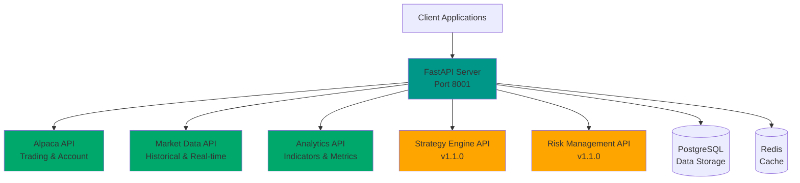

# API Reference

> **📋 Implementation Status**: ✅ Core APIs Implemented (v1.0.0)  
> **Base URL**: `http://localhost:8001/api`

## Overview

The Trading System provides a comprehensive REST API for trading operations, market data access, and system management. All APIs follow RESTful principles and return JSON responses.

## Architecture Diagram



## API Status

| API Module | Status | Version | Description |
|------------|--------|---------|-------------|
| **Execution Engine** | ✅ Implemented | v1.0.0 | Account, positions, orders management |
| **Market Data** | ✅ Implemented | v1.0.0 | Historical data, statistics, symbols |
| **Analytics** | ✅ Implemented | v1.0.0 | Technical indicators, performance metrics |
| **Data Ingestion** | ✅ Implemented | v1.0.0 | Data loading and management |
| **Strategy Engine** | 🚧 Planned | v1.1.0 | Strategy execution and signals |
| **Risk Management** | 🚧 Planned | v1.1.0 | Risk monitoring and controls |

## Status Indicators

- ✅ **Implemented**: API is fully functional and documented
- 🚧 **Planned**: API is planned for future release
- 📋 **In Progress**: API is currently being developed

## Authentication

Currently, the API uses environment-based authentication via Alpaca API keys:

```bash
# Configure in .env file
ALPACA_API_KEY=your_api_key_here
ALPACA_SECRET_KEY=your_secret_key_here
```

## Response Format

All API responses follow a standard format:

### Success Response
```json
{
  "status": "success",
  "data": { ... },
  "timestamp": "2025-12-01T12:00:00Z"
}
```

### Error Response
```json
{
  "status": "error",
  "error": {
    "code": "ERROR_CODE",
    "message": "Error description",
    "details": { ... }
  },
  "timestamp": "2025-12-01T12:00:00Z"
}
```

## Rate Limiting

- **Default**: No rate limiting (local deployment)
- **Production**: Rate limiting will be implemented in v1.2.0

## API Endpoints

### Trading & Account Management
- [Execution Engine API](execution.md) - Account, positions, orders

### Market Data
- [Data Ingestion API](data-ingestion.md) - Data loading and management
- [Analytics API](analytics.md) - Technical indicators and metrics

### Strategy & Risk (Planned)
- [Strategy Engine API](strategy-engine.md) - Strategy execution (v1.1.0)
- [Risk Management API](risk-management.md) - Risk controls (v1.1.0)

## Quick Start

### Test API Health
```bash
curl http://localhost:8001/health
```

### Get Market Data Statistics
```bash
curl http://localhost:8001/api/market-data/stats
```

### Get Account Information
```bash
curl http://localhost:8001/api/alpaca/account
```

## Interactive API Documentation

Once the FastAPI server is running, visit:
- **Swagger UI**: http://localhost:8001/docs
- **ReDoc**: http://localhost:8001/redoc

## Support

For API questions or issues:
- Check [Troubleshooting Guide](../troubleshooting.md)
- Review [GitHub Issues](https://github.com/nishantnayar/trading-system/issues)
- Contact: nishant.nayar@hotmail.com

