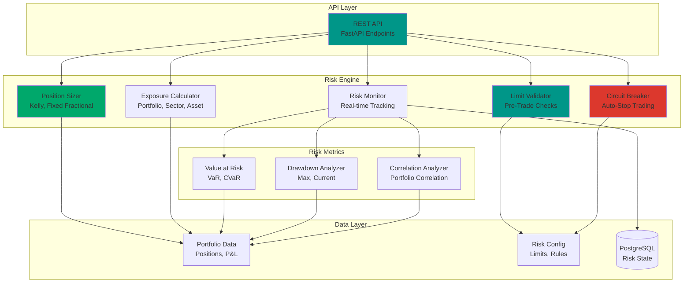

# Risk Management API

> **📋 Implementation Status**: 🚧 Planned for v1.1.0  
> **Current Status**: Module structure exists, core implementation pending

This guide covers the risk management API endpoints for portfolio risk monitoring, position sizing, risk limit validation, and automated risk controls.

## Overview

The Risk Management module provides a comprehensive REST API for:
- Portfolio risk monitoring and metrics
- Position sizing calculations
- Risk limit validation
- Exposure tracking (total, sector, asset, correlation)
- Circuit breaker management
- Risk alerts and notifications

## Architecture



## Base URL

```
http://localhost:8001/api/risk
```

## Authentication

All endpoints require Alpaca API credentials configured in your environment:

```bash
ALPACA_API_KEY=your_api_key_here
ALPACA_SECRET_KEY=your_secret_key_here
ALPACA_BASE_URL=https://paper-api.alpaca.markets
```

## Response Format

All API responses follow a standard format:

### Success Response
```json
{
  "status": "success",
  "data": { ... },
  "timestamp": "2025-12-01T12:00:00Z"
}
```

### Error Response
```json
{
  "status": "error",
  "error": {
    "code": "ERROR_CODE",
    "message": "Error description",
    "details": { ... }
  },
  "timestamp": "2025-12-01T12:00:00Z"
}
```

## API Endpoints

### Risk Monitoring

#### Get Portfolio Risk Metrics
```http
GET /api/risk/metrics
```

**Query Parameters:**
- `period` (optional): Time period for metrics ("1d", "1w", "1m", "3m", "6m", "1y", "all")

**Response:**
```json
{
  "status": "success",
  "data": {
    "portfolio_value": 115000,
    "total_exposure": 0.75,
    "cash": 28750,
    "exposure": {
      "total": 0.75,
      "by_sector": {
        "Technology": 0.35,
        "Financial Services": 0.20,
        "Healthcare": 0.15,
        "Consumer Cyclical": 0.05
      },
      "by_asset": {
        "AAPL": 0.15,
        "MSFT": 0.12,
        "GOOGL": 0.10
      },
      "max_position": 0.15,
      "max_sector": 0.35
    },
    "drawdown": {
      "current": 0.02,
      "max": 0.08,
      "recovery_time": null
    },
    "var": {
      "var_95_1d": 1250.50,
      "var_99_1d": 1850.75,
      "cvar_95_1d": 1650.25,
      "cvar_99_1d": 2200.50
    },
    "returns": {
      "total_return": 0.15,
      "annualized_return": 0.18,
      "sharpe_ratio": 1.25,
      "sortino_ratio": 1.45
    },
    "correlation": {
      "portfolio_correlation": 0.65,
      "max_pair_correlation": 0.85
    },
    "timestamp": "2025-12-01T12:00:00Z"
  },
  "timestamp": "2025-12-01T12:00:00Z"
}
```

#### Get Current Drawdown
```http
GET /api/risk/drawdown
```

**Response:**
```json
{
  "status": "success",
  "data": {
    "current_drawdown": 0.02,
    "max_drawdown": 0.08,
    "drawdown_period": {
      "start_date": "2025-11-15",
      "end_date": null,
      "duration_days": 16
    },
    "peak_equity": 117500,
    "trough_equity": 108000,
    "recovery_target": 117500,
    "recovery_percentage": 0.0
  },
  "timestamp": "2025-12-01T12:00:00Z"
}
```

#### Get Value at Risk (VaR)
```http
GET /api/risk/var
```

**Query Parameters:**
- `confidence_level` (optional): Confidence level (95 or 99, default: 95)
- `time_horizon` (optional): Time horizon in days (default: 1)

**Response:**
```json
{
  "status": "success",
  "data": {
    "confidence_level": 95,
    "time_horizon_days": 1,
    "var": 1250.50,
    "cvar": 1650.25,
    "method": "historical_simulation",
    "portfolio_value": 115000,
    "var_percentage": 0.0109,
    "cvar_percentage": 0.0143
  },
  "timestamp": "2025-12-01T12:00:00Z"
}
```

### Position Sizing

#### Calculate Position Size
```http
POST /api/risk/position-size
```

**Request Body:**
```json
{
  "symbol": "AAPL",
  "signal_strength": 0.85,
  "portfolio_value": 115000,
  "method": "fixed_fractional",
  "base_size": 0.05,
  "max_size": 0.10,
  "volatility_lookback": 20
}
```

**Response:**
```json
{
  "status": "success",
  "data": {
    "symbol": "AAPL",
    "method": "fixed_fractional",
    "recommended_size": 5750,
    "recommended_size_percentage": 0.05,
    "shares": 32,
    "current_price": 175.50,
    "position_value": 5616,
    "risk_per_share": 8.775,
    "total_risk": 280.80,
    "risk_percentage": 0.0024
  },
  "timestamp": "2025-12-01T12:00:00Z"
}
```

**Position Sizing Methods:**
- `fixed_fractional`: Fixed percentage of portfolio
- `volatility`: Size based on asset volatility
- `kelly`: Kelly Criterion optimal sizing
- `risk_parity`: Equal risk contribution

#### Get Position Sizing Methods
```http
GET /api/risk/position-size/methods
```

**Response:**
```json
{
  "status": "success",
  "data": {
    "methods": [
      {
        "id": "fixed_fractional",
        "name": "Fixed Fractional",
        "description": "Allocates fixed percentage of portfolio per position",
        "parameters": ["base_size", "max_size", "min_size"]
      },
      {
        "id": "volatility",
        "name": "Volatility-Based",
        "description": "Adjusts position size based on asset volatility",
        "parameters": ["volatility_lookback", "target_volatility"]
      },
      {
        "id": "kelly",
        "name": "Kelly Criterion",
        "description": "Optimal position sizing based on win rate and average win/loss",
        "parameters": ["win_rate", "avg_win", "avg_loss"]
      },
      {
        "id": "risk_parity",
        "name": "Risk Parity",
        "description": "Equal risk contribution from each position",
        "parameters": ["target_risk"]
      }
    ]
  },
  "timestamp": "2025-12-01T12:00:00Z"
}
```

### Risk Limit Validation

#### Validate Trade
```http
POST /api/risk/validate
```

**Request Body:**
```json
{
  "symbol": "AAPL",
  "side": "BUY",
  "quantity": 50,
  "price": 175.50,
  "strategy_id": "momentum_strategy"
}
```

**Response:**
```json
{
  "status": "success",
  "data": {
    "approved": true,
    "checks": {
      "position_size": {
        "passed": true,
        "current_size": 0.15,
        "limit": 0.10,
        "message": "Position size exceeds limit"
      },
      "total_exposure": {
        "passed": true,
        "current_exposure": 0.75,
        "limit": 0.80,
        "message": "Within total exposure limit"
      },
      "sector_exposure": {
        "passed": true,
        "current_exposure": 0.35,
        "limit": 0.30,
        "message": "Sector exposure exceeds limit"
      },
      "daily_loss": {
        "passed": true,
        "current_loss": 0.01,
        "limit": 0.02,
        "message": "Within daily loss limit"
      },
      "drawdown": {
        "passed": true,
        "current_drawdown": 0.02,
        "limit": 0.05,
        "message": "Within drawdown limit"
      }
    },
    "warnings": [
      "Position size exceeds recommended limit",
      "Sector exposure approaching limit"
    ],
    "recommended_action": "reduce_position_size"
  },
  "timestamp": "2025-12-01T12:00:00Z"
}
```

#### Get Risk Limits
```http
GET /api/risk/limits
```

**Query Parameters:**
- `strategy_id` (optional): Filter by strategy

**Response:**
```json
{
  "status": "success",
  "data": {
    "global_limits": {
      "max_total_exposure": 0.80,
      "max_position_size": 0.10,
      "max_drawdown": 0.10,
      "max_daily_loss": 0.05
    },
    "strategy_limits": [
      {
        "strategy_id": "momentum_strategy",
        "max_drawdown": 0.05,
        "max_daily_loss": 0.02,
        "max_positions": 10,
        "max_sector_exposure": 0.30,
        "max_position_size": 0.10
      }
    ]
  },
  "timestamp": "2025-12-01T12:00:00Z"
}
```

#### Update Risk Limits
```http
PUT /api/risk/limits
```

**Request Body:**
```json
{
  "global_limits": {
    "max_total_exposure": 0.75,
    "max_drawdown": 0.08
  },
  "strategy_limits": [
    {
      "strategy_id": "momentum_strategy",
      "max_daily_loss": 0.015
    }
  ]
}
```

**Response:**
```json
{
  "status": "success",
  "data": {
    "message": "Risk limits updated successfully",
    "updated_at": "2025-12-01T12:00:00Z"
  },
  "timestamp": "2025-12-01T12:00:00Z"
}
```

### Exposure Tracking

#### Get Portfolio Exposure
```http
GET /api/risk/exposure
```

**Query Parameters:**
- `type` (optional): Exposure type ("total", "sector", "asset", "correlation")

**Response:**
```json
{
  "status": "success",
  "data": {
    "total_exposure": 0.75,
    "cash": 0.25,
    "by_sector": {
      "Technology": {
        "exposure": 0.35,
        "value": 40250,
        "positions": 3
      },
      "Financial Services": {
        "exposure": 0.20,
        "value": 23000,
        "positions": 2
      }
    },
    "by_asset": {
      "AAPL": {
        "exposure": 0.15,
        "value": 17250,
        "shares": 100
      },
      "MSFT": {
        "exposure": 0.12,
        "value": 13800,
        "shares": 36
      }
    },
    "correlation": {
      "portfolio_correlation": 0.65,
      "max_pair_correlation": 0.85,
      "correlated_pairs": [
        {
          "symbol1": "AAPL",
          "symbol2": "MSFT",
          "correlation": 0.85
        }
      ]
    },
    "limits": {
      "max_total_exposure": 0.80,
      "max_position_size": 0.10,
      "max_sector_exposure": 0.30
    },
    "warnings": [
      "Technology sector exposure (35%) exceeds recommended limit (30%)"
    ]
  },
  "timestamp": "2025-12-01T12:00:00Z"
}
```

### Circuit Breakers

#### Get Circuit Breaker Status
```http
GET /api/risk/circuit-breakers
```

**Response:**
```json
{
  "status": "success",
  "data": {
    "circuit_breakers": [
      {
        "id": "drawdown",
        "enabled": true,
        "triggered": false,
        "threshold": 0.10,
        "current_value": 0.02,
        "action": "stop_all"
      },
      {
        "id": "daily_loss",
        "enabled": true,
        "triggered": false,
        "threshold": 0.05,
        "current_value": 0.01,
        "action": "stop_all",
        "reset_time": "2025-12-02T09:30:00Z"
      },
      {
        "id": "volatility",
        "enabled": true,
        "triggered": false,
        "threshold": 30,
        "current_value": 18.5,
        "action": "stop_new"
      }
    ],
    "trading_status": "active"
  },
  "timestamp": "2025-12-01T12:00:00Z"
}
```

#### Update Circuit Breaker
```http
PUT /api/risk/circuit-breakers/{breaker_id}
```

**Request Body:**
```json
{
  "enabled": true,
  "threshold": 0.08,
  "action": "stop_all"
}
```

**Response:**
```json
{
  "status": "success",
  "data": {
    "id": "drawdown",
    "enabled": true,
    "threshold": 0.08,
    "action": "stop_all",
    "updated_at": "2025-12-01T12:00:00Z"
  },
  "timestamp": "2025-12-01T12:00:00Z"
}
```

#### Reset Circuit Breaker
```http
POST /api/risk/circuit-breakers/{breaker_id}/reset
```

**Response:**
```json
{
  "status": "success",
  "data": {
    "id": "daily_loss",
    "triggered": false,
    "reset_at": "2025-12-01T12:00:00Z"
  },
  "timestamp": "2025-12-01T12:00:00Z"
}
```

### Risk Alerts

#### Get Risk Alerts
```http
GET /api/risk/alerts
```

**Query Parameters:**
- `status` (optional): Filter by status ("active", "resolved", "all")
- `severity` (optional): Filter by severity ("low", "medium", "high", "critical")

**Response:**
```json
{
  "status": "success",
  "data": {
    "alerts": [
      {
        "id": "alert_12345",
        "type": "exposure",
        "severity": "medium",
        "status": "active",
        "message": "Technology sector exposure (35%) exceeds recommended limit (30%)",
        "threshold": 0.30,
        "current_value": 0.35,
        "created_at": "2025-12-01T10:00:00Z"
      },
      {
        "id": "alert_12346",
        "type": "drawdown",
        "severity": "low",
        "status": "active",
        "message": "Current drawdown (2%) approaching alert threshold (3%)",
        "threshold": 0.03,
        "current_value": 0.02,
        "created_at": "2025-12-01T11:00:00Z"
      }
    ],
    "count": 2,
    "active_count": 2
  },
  "timestamp": "2025-12-01T12:00:00Z"
}
```

#### Acknowledge Alert
```http
POST /api/risk/alerts/{alert_id}/acknowledge
```

**Response:**
```json
{
  "status": "success",
  "data": {
    "id": "alert_12345",
    "status": "acknowledged",
    "acknowledged_at": "2025-12-01T12:00:00Z"
  },
  "timestamp": "2025-12-01T12:00:00Z"
}
```

## Risk Metrics

### Value at Risk (VaR)

Maximum expected loss over a time horizon at a given confidence level.

**Methods:**
- Historical Simulation
- Parametric (Variance-Covariance)
- Monte Carlo Simulation

### Conditional VaR (CVaR)

Expected loss beyond the VaR threshold (also known as Expected Shortfall).

### Maximum Drawdown

Largest peak-to-trough decline in portfolio value.

### Sharpe Ratio

Risk-adjusted return metric: (Return - Risk-free rate) / Volatility

### Sortino Ratio

Downside risk-adjusted return: (Return - Risk-free rate) / Downside Deviation

## Implementation Roadmap

### v1.1.0 (In Progress) 🚧
- Basic position sizing algorithms
- Portfolio exposure tracking
- Risk limit validation
- Simple alert system
- Basic circuit breakers

### v1.2.0 (Planned) 📋
- Advanced risk metrics (VaR, CVaR)
- Correlation analysis
- Stress testing
- Automated risk reports
- Advanced circuit breakers
- Real-time risk monitoring

### v1.3.0 (Future) 🔮
- Machine learning risk models
- Portfolio optimization
- Regulatory compliance reporting
- Advanced stress testing scenarios
- Risk attribution analysis

## Error Codes

| Code | Description |
|------|-------------|
| `RISK_LIMIT_EXCEEDED` | Trade exceeds risk limits |
| `CIRCUIT_BREAKER_TRIGGERED` | Circuit breaker is active, trading stopped |
| `INSUFFICIENT_DATA` | Insufficient data for risk calculation |
| `INVALID_POSITION_SIZE` | Invalid position size calculation |
| `EXPOSURE_LIMIT_EXCEEDED` | Exposure limit exceeded |

## Usage Examples

### Check Risk Before Trading

```python
import requests

# Validate trade
response = requests.post("http://localhost:8001/api/risk/validate", json={
    "symbol": "AAPL",
    "side": "BUY",
    "quantity": 50,
    "price": 175.50,
    "strategy_id": "momentum_strategy"
})

validation = response.json()["data"]
if validation["approved"]:
    print("Trade approved")
    # Execute trade
else:
    print("Trade rejected:", validation["warnings"])
```

### Monitor Portfolio Risk

```python
# Get risk metrics
response = requests.get("http://localhost:8001/api/risk/metrics")
metrics = response.json()["data"]

print(f"Total Exposure: {metrics['exposure']['total']:.2%}")
print(f"Current Drawdown: {metrics['drawdown']['current']:.2%}")
print(f"VaR (95%): ${metrics['var']['var_95_1d']:.2f}")
```

### Calculate Position Size

```python
# Calculate position size
response = requests.post("http://localhost:8001/api/risk/position-size", json={
    "symbol": "AAPL",
    "signal_strength": 0.85,
    "portfolio_value": 115000,
    "method": "fixed_fractional",
    "base_size": 0.05
})

size_data = response.json()["data"]
print(f"Recommended Position: {size_data['shares']} shares")
print(f"Position Value: ${size_data['position_value']:.2f}")
```

## Related Documentation

- [Risk Management User Guide](../user-guide/risk-management.md) - User guide for risk management
- [Strategy Engine API](strategy-engine.md) - Strategy execution API
- [Execution API](execution.md) - Order execution API
- [Analytics API](analytics.md) - Performance analytics API

---

**Last Updated**: December 2025  
**Status**: 🚧 Planned for v1.1.0
