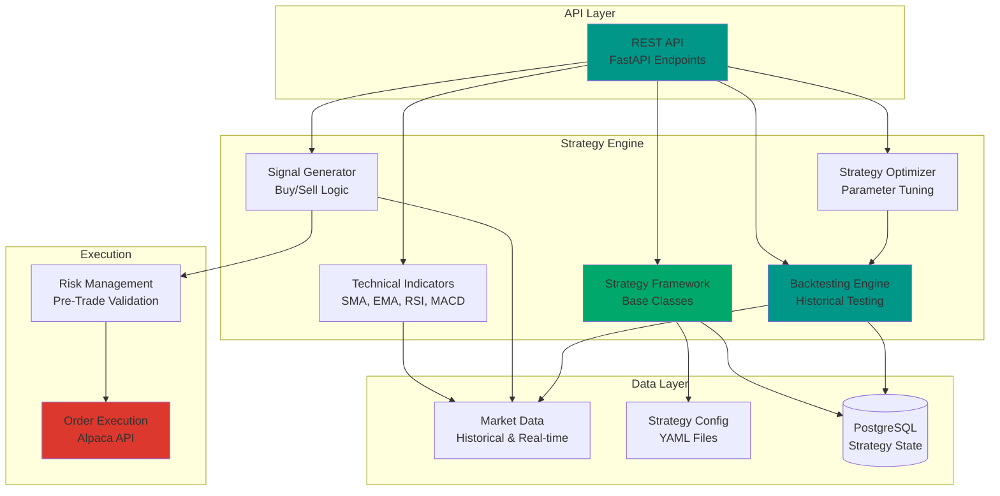

# Strategy Engine API

> **📋 Implementation Status**: 🚧 Planned for v1.1.0  
> **Current Status**: Module structure exists, core implementation pending

This guide covers the strategy engine API endpoints for algorithmic trading strategy management, signal generation, backtesting, and performance tracking.

## Overview

The Strategy Engine module provides a comprehensive REST API for:
- Strategy creation, configuration, and management
- Technical indicator calculations
- Signal generation and validation
- Backtesting and performance analysis
- Strategy optimization
- Real-time strategy execution

## Architecture



## Base URL

```
http://localhost:8001/api/strategies
```

## Authentication

All endpoints require Alpaca API credentials configured in your environment:

```bash
ALPACA_API_KEY=your_api_key_here
ALPACA_SECRET_KEY=your_secret_key_here
ALPACA_BASE_URL=https://paper-api.alpaca.markets
```

## Response Format

All API responses follow a standard format:

### Success Response
```json
{
  "status": "success",
  "data": { ... },
  "timestamp": "2025-12-01T12:00:00Z"
}
```

### Error Response
```json
{
  "status": "error",
  "error": {
    "code": "ERROR_CODE",
    "message": "Error description",
    "details": { ... }
  },
  "timestamp": "2025-12-01T12:00:00Z"
}
```

## API Endpoints

### Strategy Management

#### List All Strategies
```http
GET /api/strategies
```

**Response:**
```json
{
  "status": "success",
  "data": {
    "strategies": [
      {
        "id": "momentum_strategy",
        "name": "momentum_strategy",
        "enabled": true,
        "description": "Simple momentum-based trading strategy",
        "type": "momentum",
        "parameters": {
          "lookback_period": 20,
          "momentum_threshold": 0.02,
          "max_position_size": 0.1,
          "stop_loss": 0.05,
          "take_profit": 0.10
        },
        "risk_limits": {
          "max_drawdown": 0.05,
          "max_daily_loss": 0.02,
          "max_positions": 10,
          "max_sector_exposure": 0.3
        },
        "performance": {
          "total_return": 0.15,
          "sharpe_ratio": 1.25,
          "max_drawdown": 0.03,
          "win_rate": 0.55
        },
        "created_at": "2025-01-01T00:00:00Z",
        "updated_at": "2025-12-01T12:00:00Z"
      }
    ],
    "count": 1
  },
  "timestamp": "2025-12-01T12:00:00Z"
}
```

#### Get Strategy Details
```http
GET /api/strategies/{strategy_id}
```

**Parameters:**
- `strategy_id` (path): Strategy identifier

**Response:**
```json
{
  "status": "success",
  "data": {
    "id": "momentum_strategy",
    "name": "momentum_strategy",
    "enabled": true,
    "description": "Simple momentum-based trading strategy",
    "type": "momentum",
    "parameters": {
      "lookback_period": 20,
      "momentum_threshold": 0.02,
      "max_position_size": 0.1,
      "stop_loss": 0.05,
      "take_profit": 0.10
    },
    "risk_limits": {
      "max_drawdown": 0.05,
      "max_daily_loss": 0.02,
      "max_positions": 10,
      "max_sector_exposure": 0.3
    },
    "schedule": {
      "run_frequency": "hourly",
      "market_hours_only": true
    },
    "performance": {
      "total_return": 0.15,
      "annualized_return": 0.18,
      "sharpe_ratio": 1.25,
      "sortino_ratio": 1.45,
      "max_drawdown": 0.03,
      "win_rate": 0.55,
      "profit_factor": 1.35,
      "total_trades": 120,
      "winning_trades": 66,
      "losing_trades": 54
    },
    "created_at": "2025-01-01T00:00:00Z",
    "updated_at": "2025-12-01T12:00:00Z"
  },
  "timestamp": "2025-12-01T12:00:00Z"
}
```

#### Create Strategy
```http
POST /api/strategies
```

**Request Body:**
```json
{
  "name": "my_custom_strategy",
  "type": "momentum",
  "description": "Custom momentum strategy",
  "enabled": true,
  "parameters": {
    "lookback_period": 30,
    "momentum_threshold": 0.03,
    "max_position_size": 0.05,
    "stop_loss": 0.05,
    "take_profit": 0.10
  },
  "risk_limits": {
    "max_drawdown": 0.05,
    "max_daily_loss": 0.02,
    "max_positions": 5,
    "max_sector_exposure": 0.25
  },
  "schedule": {
    "run_frequency": "hourly",
    "market_hours_only": true
  }
}
```

**Response:**
```json
{
  "status": "success",
  "data": {
    "id": "my_custom_strategy",
    "name": "my_custom_strategy",
    "enabled": true,
    "created_at": "2025-12-01T12:00:00Z"
  },
  "timestamp": "2025-12-01T12:00:00Z"
}
```

#### Update Strategy
```http
PUT /api/strategies/{strategy_id}
```

**Request Body:**
```json
{
  "enabled": false,
  "parameters": {
    "lookback_period": 25,
    "momentum_threshold": 0.025
  }
}
```

**Response:**
```json
{
  "status": "success",
  "data": {
    "id": "momentum_strategy",
    "updated_at": "2025-12-01T12:00:00Z"
  },
  "timestamp": "2025-12-01T12:00:00Z"
}
```

#### Delete Strategy
```http
DELETE /api/strategies/{strategy_id}
```

**Response:**
```json
{
  "status": "success",
  "data": {
    "message": "Strategy deleted successfully"
  },
  "timestamp": "2025-12-01T12:00:00Z"
}
```

#### Enable/Disable Strategy
```http
POST /api/strategies/{strategy_id}/enable
POST /api/strategies/{strategy_id}/disable
```

**Response:**
```json
{
  "status": "success",
  "data": {
    "id": "momentum_strategy",
    "enabled": true,
    "updated_at": "2025-12-01T12:00:00Z"
  },
  "timestamp": "2025-12-01T12:00:00Z"
}
```

### Signal Generation

#### Generate Signals
```http
POST /api/strategies/{strategy_id}/signals
```

**Request Body:**
```json
{
  "symbols": ["AAPL", "MSFT", "GOOGL"],
  "timeframe": "1d",
  "date": "2025-12-01"
}
```

**Response:**
```json
{
  "status": "success",
  "data": {
    "strategy_id": "momentum_strategy",
    "signals": [
      {
        "symbol": "AAPL",
        "signal": "BUY",
        "strength": 0.85,
        "price": 175.50,
        "indicators": {
          "sma_20": 172.30,
          "sma_50": 168.90,
          "rsi": 65.5,
          "momentum": 0.025
        },
        "timestamp": "2025-12-01T12:00:00Z"
      },
      {
        "symbol": "MSFT",
        "signal": "SELL",
        "strength": 0.72,
        "price": 380.25,
        "indicators": {
          "sma_20": 385.10,
          "sma_50": 390.50,
          "rsi": 35.2,
          "momentum": -0.015
        },
        "timestamp": "2025-12-01T12:00:00Z"
      }
    ],
    "count": 2
  },
  "timestamp": "2025-12-01T12:00:00Z"
}
```

#### Get Latest Signals
```http
GET /api/strategies/{strategy_id}/signals/latest
```

**Query Parameters:**
- `symbols` (optional): Comma-separated list of symbols
- `limit` (optional): Maximum number of signals (default: 100)

**Response:**
```json
{
  "status": "success",
  "data": {
    "signals": [
      {
        "symbol": "AAPL",
        "signal": "BUY",
        "strength": 0.85,
        "price": 175.50,
        "timestamp": "2025-12-01T12:00:00Z"
      }
    ],
    "count": 1
  },
  "timestamp": "2025-12-01T12:00:00Z"
}
```

### Technical Indicators

#### Calculate Indicators
```http
POST /api/strategies/indicators/calculate
```

**Request Body:**
```json
{
  "symbol": "AAPL",
  "indicators": ["SMA", "EMA", "RSI", "MACD"],
  "periods": {
    "SMA": [20, 50, 200],
    "EMA": [12, 26],
    "RSI": [14],
    "MACD": [12, 26, 9]
  },
  "start_date": "2025-01-01",
  "end_date": "2025-12-01"
}
```

**Response:**
```json
{
  "status": "success",
  "data": {
    "symbol": "AAPL",
    "indicators": {
      "SMA_20": 172.30,
      "SMA_50": 168.90,
      "SMA_200": 165.50,
      "EMA_12": 173.10,
      "EMA_26": 170.20,
      "RSI_14": 65.5,
      "MACD": {
        "macd_line": 2.80,
        "signal_line": 2.45,
        "histogram": 0.35
      }
    },
    "timestamp": "2025-12-01T12:00:00Z"
  },
  "timestamp": "2025-12-01T12:00:00Z"
}
```

### Backtesting

#### Run Backtest
```http
POST /api/strategies/{strategy_id}/backtest
```

**Request Body:**
```json
{
  "symbols": ["AAPL", "MSFT", "GOOGL"],
  "start_date": "2024-01-01",
  "end_date": "2024-12-31",
  "initial_capital": 100000,
  "commission": 0.001,
  "slippage": 0.0005
}
```

**Response:**
```json
{
  "status": "success",
  "data": {
    "backtest_id": "backtest_12345",
    "strategy_id": "momentum_strategy",
    "status": "completed",
    "results": {
      "initial_capital": 100000,
      "final_capital": 115000,
      "total_return": 0.15,
      "annualized_return": 0.15,
      "sharpe_ratio": 1.25,
      "sortino_ratio": 1.45,
      "max_drawdown": 0.08,
      "win_rate": 0.55,
      "profit_factor": 1.35,
      "total_trades": 120,
      "winning_trades": 66,
      "losing_trades": 54,
      "average_win": 250.50,
      "average_loss": -185.30,
      "largest_win": 850.00,
      "largest_loss": -450.00
    },
    "trades": [
      {
        "symbol": "AAPL",
        "entry_date": "2024-01-15",
        "exit_date": "2024-01-25",
        "entry_price": 175.50,
        "exit_price": 180.25,
        "quantity": 10,
        "pnl": 47.50,
        "return": 0.027
      }
    ],
    "equity_curve": [
      {
        "date": "2024-01-01",
        "equity": 100000
      },
      {
        "date": "2024-12-31",
        "equity": 115000
      }
    ],
    "created_at": "2025-12-01T12:00:00Z",
    "completed_at": "2025-12-01T12:05:00Z"
  },
  "timestamp": "2025-12-01T12:00:00Z"
}
```

#### Get Backtest Results
```http
GET /api/strategies/backtests/{backtest_id}
```

**Response:**
Same as Run Backtest response above.

#### List Backtests
```http
GET /api/strategies/{strategy_id}/backtests
```

**Query Parameters:**
- `limit` (optional): Maximum number of backtests (default: 50)
- `offset` (optional): Pagination offset (default: 0)

**Response:**
```json
{
  "status": "success",
  "data": {
    "backtests": [
      {
        "backtest_id": "backtest_12345",
        "strategy_id": "momentum_strategy",
        "start_date": "2024-01-01",
        "end_date": "2024-12-31",
        "status": "completed",
        "total_return": 0.15,
        "sharpe_ratio": 1.25,
        "created_at": "2025-12-01T12:00:00Z"
      }
    ],
    "count": 1,
    "total": 1
  },
  "timestamp": "2025-12-01T12:00:00Z"
}
```

### Strategy Optimization

#### Optimize Strategy Parameters
```http
POST /api/strategies/{strategy_id}/optimize
```

**Request Body:**
```json
{
  "symbols": ["AAPL", "MSFT"],
  "start_date": "2024-01-01",
  "end_date": "2024-12-31",
  "parameters": {
    "lookback_period": [10, 20, 30, 40, 50],
    "momentum_threshold": [0.01, 0.02, 0.03, 0.04, 0.05]
  },
  "objective": "sharpe_ratio",
  "constraints": {
    "min_trades": 50,
    "max_drawdown": 0.10
  },
  "method": "grid_search"
}
```

**Response:**
```json
{
  "status": "success",
  "data": {
    "optimization_id": "opt_12345",
    "strategy_id": "momentum_strategy",
    "status": "completed",
    "best_parameters": {
      "lookback_period": 20,
      "momentum_threshold": 0.02
    },
    "best_performance": {
      "total_return": 0.18,
      "sharpe_ratio": 1.45,
      "max_drawdown": 0.06
    },
    "parameter_combinations": [
      {
        "lookback_period": 20,
        "momentum_threshold": 0.02,
        "total_return": 0.18,
        "sharpe_ratio": 1.45
      }
    ],
    "created_at": "2025-12-01T12:00:00Z",
    "completed_at": "2025-12-01T12:30:00Z"
  },
  "timestamp": "2025-12-01T12:00:00Z"
}
```

### Performance Tracking

#### Get Strategy Performance
```http
GET /api/strategies/{strategy_id}/performance
```

**Query Parameters:**
- `start_date` (optional): Start date for performance period
- `end_date` (optional): End date for performance period
- `period` (optional): Predefined period ("1d", "1w", "1m", "3m", "6m", "1y", "all")

**Response:**
```json
{
  "status": "success",
  "data": {
    "strategy_id": "momentum_strategy",
    "period": {
      "start_date": "2025-01-01",
      "end_date": "2025-12-01"
    },
    "performance": {
      "total_return": 0.15,
      "annualized_return": 0.18,
      "sharpe_ratio": 1.25,
      "sortino_ratio": 1.45,
      "max_drawdown": 0.08,
      "current_drawdown": 0.02,
      "win_rate": 0.55,
      "profit_factor": 1.35,
      "total_trades": 120,
      "winning_trades": 66,
      "losing_trades": 54,
      "average_win": 250.50,
      "average_loss": -185.30,
      "largest_win": 850.00,
      "largest_loss": -450.00
    },
    "equity_curve": [
      {
        "date": "2025-01-01",
        "equity": 100000,
        "return": 0.0
      },
      {
        "date": "2025-12-01",
        "equity": 115000,
        "return": 0.15
      }
    ],
    "monthly_returns": [
      {
        "month": "2025-01",
        "return": 0.02
      }
    ]
  },
  "timestamp": "2025-12-01T12:00:00Z"
}
```

## Strategy Types

### Momentum Strategy

Trades based on price momentum and trend following.

**Parameters:**
- `lookback_period`: Days to calculate momentum (default: 20)
- `momentum_threshold`: Minimum price change for signal (default: 0.02)
- `max_position_size`: Maximum position size (default: 0.1)
- `stop_loss`: Stop loss percentage (default: 0.05)
- `take_profit`: Take profit percentage (default: 0.10)

### Mean Reversion Strategy

Trades based on oversold/overbought conditions using RSI.

**Parameters:**
- `lookback_period`: RSI calculation period (default: 14)
- `rsi_oversold`: RSI level for buy signal (default: 30)
- `rsi_overbought`: RSI level for sell signal (default: 70)
- `position_size`: Position size (default: 0.05)

### Pairs Trading Strategy

Statistical arbitrage using correlated stock pairs.

**Parameters:**
- `lookback_period`: Days for spread calculation (default: 252)
- `entry_threshold`: Z-score for entry (default: 2.0)
- `exit_threshold`: Z-score for exit (default: 0.5)
- `stop_loss_threshold`: Z-score stop loss (default: 3.0)
- `position_size`: Position size per pair (default: 0.05)

## Implementation Roadmap

### v1.1.0 (In Progress) 🚧
- Basic strategy framework
- Simple moving average strategies
- Backtesting engine
- Performance metrics calculation
- REST API endpoints

### v1.2.0 (Planned) 📋
- Advanced strategies (mean reversion, momentum, pairs trading)
- Machine learning integration
- Multi-asset strategies
- Real-time signal generation
- Advanced optimization tools
- WebSocket support for real-time updates

## Error Codes

| Code | Description |
|------|-------------|
| `STRATEGY_NOT_FOUND` | Strategy with given ID not found |
| `STRATEGY_ALREADY_EXISTS` | Strategy with given name already exists |
| `INVALID_PARAMETERS` | Strategy parameters are invalid |
| `BACKTEST_FAILED` | Backtest execution failed |
| `INSUFFICIENT_DATA` | Insufficient market data for operation |
| `OPTIMIZATION_FAILED` | Strategy optimization failed |

## Usage Examples

### Create and Test a Strategy

```python
import requests

# Create strategy
response = requests.post("http://localhost:8001/api/strategies", json={
    "name": "my_strategy",
    "type": "momentum",
    "parameters": {
        "lookback_period": 20,
        "momentum_threshold": 0.02
    }
})

# Run backtest
response = requests.post(
    "http://localhost:8001/api/strategies/my_strategy/backtest",
    json={
        "symbols": ["AAPL", "MSFT"],
        "start_date": "2024-01-01",
        "end_date": "2024-12-31",
        "initial_capital": 100000
    }
)

# Get results
backtest_id = response.json()["data"]["backtest_id"]
results = requests.get(f"http://localhost:8001/api/strategies/backtests/{backtest_id}")
print(results.json()["data"]["results"])
```

## Related Documentation

- [Strategy Management User Guide](../user-guide/strategies.md) - User guide for strategy management
- [Risk Management API](risk-management.md) - Risk management API
- [Analytics API](analytics.md) - Technical indicators API
- [Execution API](execution.md) - Order execution API

---

**Last Updated**: December 2025  
**Status**: 🚧 Planned for v1.1.0
