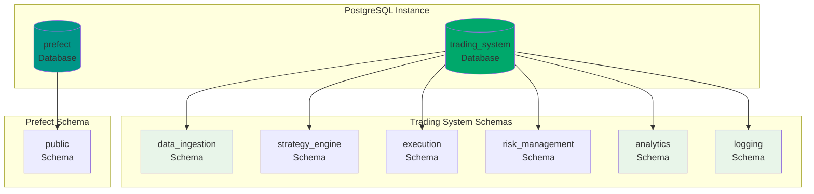

# Database Architecture

## Overview

This document provides an index to the database architecture documentation. For detailed information on specific aspects, please refer to the dedicated documents below:

## Database Sub-documents

- [**Database Overview**](database-overview.md): High-level architecture, distribution strategy, setup options, and implementation approach.
- [**Database Schema**](database-schema.md): Comprehensive schema definitions for all database tables, including constraints, indexes, and relationships.
- [**Database Optimization**](database-optimization.md): Performance tuning, indexing strategies, partitioning, ORM patterns, monitoring, and maintenance.

---

**Note**: This document serves as an index to the modular database documentation.

## Database Architecture Diagram

