# Development Documentation

> **📋 Status**: ✅ Core Development Docs Complete | 🚧 Additional Guides In Progress

## Overview

This section contains comprehensive technical documentation for developers working on or contributing to the Trading System.

## Architecture Documentation

### System Architecture
- [System Architecture](architecture.md) - Complete system design and architecture
- [Stock Screener Architecture](stock-screener-architecture.md) - AI-powered screener implementation

### Database
- [Database Architecture](database.md) - Database design, schema, and optimization

### Logging
- [Logging Architecture](logging.md) - Structured logging with PostgreSQL

### Workflow Orchestration
- [Prefect Deployment](prefect-deployment.md) - Overview and implementation
- [Prefect Deployment Operations](prefect-deployment-operations.md) - Step-by-step runbook

## Development Workflow

### Testing
- [Testing Strategy](testing.md) - Testing guidelines and best practices
- [Session Management Testing](session-management-testing.md) - Streamlit session testing

### CI/CD
- [CI/CD Pipeline](ci-cd.md) - Continuous integration and deployment

## System Architecture Diagram

```mermaid
graph TB
    subgraph "Frontend Layer"
        Streamlit[Streamlit UI<br/>Port 8501]
    end
    
    subgraph "API Layer"
        FastAPI[FastAPI Server<br/>Port 8001]
    end
    
    subgraph "Service Layer"
        DataIngestion[Data Ingestion<br/>✅ v1.0.0]
        StrategyEngine[Strategy Engine<br/>🚧 v1.1.0]
        Execution[Execution<br/>✅ v1.0.0]
        RiskMgmt[Risk Management<br/>🚧 v1.1.0]
        Analytics[Analytics<br/>✅ v1.0.0]
        Notification[Notification<br/>🚧 v1.1.0]
    end
    
    subgraph "Orchestration"
        Prefect[Prefect Server<br/>Port 4200]
    end
    
    subgraph "Data Layer"
        PostgreSQL[(PostgreSQL<br/>trading_system + prefect)]
        Redis[(Redis<br/>Cache)]
    end
    
    subgraph "External Services"
        Alpaca[Alpaca API]
        Polygon[Polygon.io]
        Yahoo[Yahoo Finance]
        Ollama[Ollama LLM]
    end
    
    Streamlit --> FastAPI
    FastAPI --> DataIngestion
    FastAPI --> StrategyEngine
    FastAPI --> Execution
    FastAPI --> RiskMgmt
    FastAPI --> Analytics
    
    DataIngestion --> Polygon
    DataIngestion --> Yahoo
    DataIngestion --> Alpaca
    Analytics --> Ollama
    
    Prefect --> DataIngestion
    Prefect --> Analytics
    
    DataIngestion --> PostgreSQL
    Execution --> PostgreSQL
    Analytics --> PostgreSQL
    StrategyEngine --> PostgreSQL
    
    DataIngestion --> Redis
    Analytics --> Redis
    
    Execution --> Alpaca
    
    style DataIngestion fill:#00A86B
    style Execution fill:#00A86B
    style Analytics fill:#00A86B
    style StrategyEngine fill:#FFA500
    style RiskMgmt fill:#FFA500
    style Notification fill:#FFA500
```

## Status Indicators

- ✅ **Implemented**: Feature is complete and working
- 🚧 **In Progress**: Feature is being developed
- 📋 **Planned**: Feature is planned for future release
- 🔮 **Future**: Feature is under consideration

## Development Resources

### Getting Started
1. Read [System Architecture](architecture.md) for overview
2. Review [Database Architecture](database.md) for data structure
3. Check [Testing Strategy](testing.md) for testing guidelines
4. Follow [Prefect Deployment Operations](prefect-deployment-operations.md) for workflow setup

### Code Quality
- **Formatting**: Black (88 char line length)
- **Import Sorting**: isort
- **Linting**: Flake8
- **Type Checking**: mypy
- **Testing**: pytest

### Contributing
See [CONTRIBUTING.md](../../CONTRIBUTING.md) for contribution guidelines.

## Quick Links

- [Main README](../../Readme.md)
- [API Reference](../api/index.md)
- [Troubleshooting](../troubleshooting.md)
- [GitHub Repository](https://github.com/nishantnayar/trading-system)

