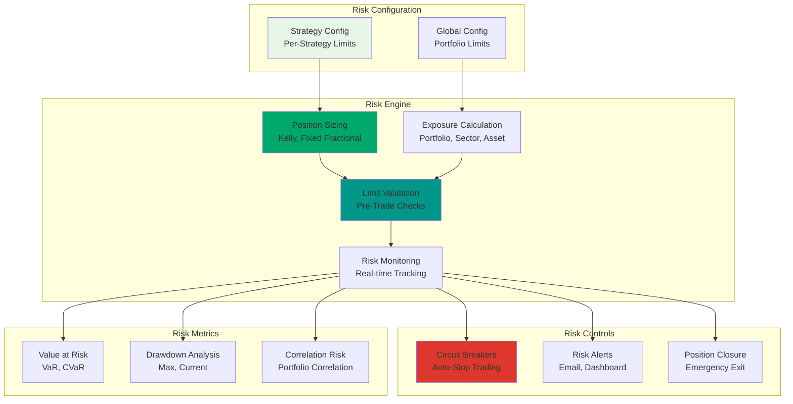
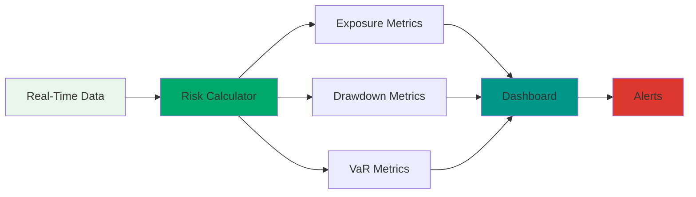
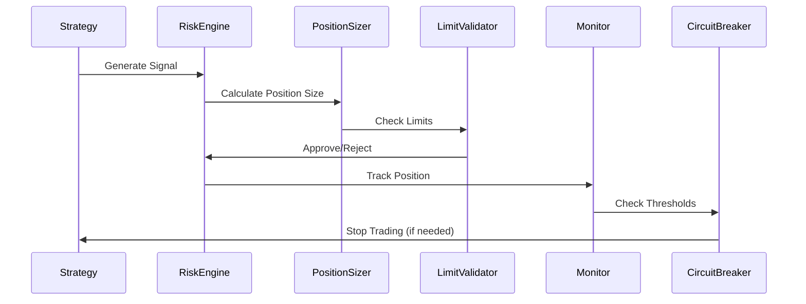

# Risk Management

> **📋 Implementation Status**: 🚧 Planned for v1.1.0  
> **Current Status**: Risk limits defined in strategy configuration, risk management module implementation pending

This guide covers risk management features, configuration, and best practices for the trading system.

## Overview

The Risk Management module provides comprehensive portfolio risk monitoring, position sizing, and automated risk controls to protect capital and ensure sustainable trading operations.

## Risk Management Architecture



## Planned Risk Controls (v1.1.0)

### 1. Position Limits and Sizing

Intelligent position sizing algorithms to optimize risk-adjusted returns:

#### Position Sizing Methods

**Fixed Fractional Sizing:**
- Allocates a fixed percentage of portfolio per position
- Simple and predictable
- Example: 5% of portfolio per trade

**Volatility-Based Sizing:**
- Adjusts position size based on asset volatility
- Higher volatility = smaller position
- Maintains consistent risk across positions

**Kelly Criterion:**
- Optimal position sizing based on win rate and average win/loss
- Maximizes long-term growth
- Requires historical performance data

**Risk Parity:**
- Equal risk contribution from each position
- Diversifies risk across portfolio
- More stable portfolio performance

**Example Configuration:**
```yaml
position_sizing:
  method: "fixed_fractional"  # fixed_fractional, volatility, kelly, risk_parity
  base_size: 0.05             # 5% base position size
  max_size: 0.10              # 10% maximum position size
  min_size: 0.01              # 1% minimum position size
  volatility_lookback: 20     # Days for volatility calculation
```

### 2. Stop Losses and Take Profits

Automated exit orders to protect capital and lock in profits:

#### Stop Loss Types

**Percentage Stop Loss:**
- Exits position when loss exceeds percentage threshold
- Example: 5% stop loss

**Dollar Stop Loss:**
- Exits position when loss exceeds dollar amount
- Example: $500 stop loss

**Trailing Stop Loss:**
- Adjusts stop loss as price moves favorably
- Locks in profits while allowing upside
- Example: 3% trailing stop

**Volatility-Based Stop Loss:**
- Stop loss based on asset volatility (ATR)
- Adapts to market conditions
- Example: 2x ATR stop loss

#### Take Profit Types

**Percentage Take Profit:**
- Exits position when profit exceeds percentage threshold
- Example: 10% take profit

**Trailing Take Profit:**
- Adjusts take profit as price moves favorably
- Allows for larger gains
- Example: 5% trailing take profit

**Example Configuration:**
```yaml
exit_rules:
  stop_loss:
    type: "percentage"        # percentage, dollar, trailing, volatility
    value: 0.05               # 5% stop loss
    trailing: false
  take_profit:
    type: "percentage"        # percentage, trailing
    value: 0.10               # 10% take profit
    trailing: false
```

### 3. Real-Time Risk Monitoring

Continuous monitoring of portfolio risk metrics:

**Monitored Metrics:**
- Portfolio exposure (total, by sector, by asset)
- Current drawdown and maximum drawdown
- Value at Risk (VaR) and Conditional VaR (CVaR)
- Position concentration and correlation
- Daily P&L and cumulative returns
- Risk-adjusted returns (Sharpe, Sortino ratios)

**Monitoring Dashboard:**


### 4. Portfolio Exposure Tracking

Comprehensive exposure monitoring across multiple dimensions:

#### Exposure Types

**Total Portfolio Exposure:**
- Percentage of capital deployed
- Maximum exposure limits
- Example: Max 80% total exposure

**Sector Exposure:**
- Exposure to individual sectors
- Prevents over-concentration
- Example: Max 30% per sector

**Asset Exposure:**
- Exposure to individual assets
- Position size limits
- Example: Max 10% per asset

**Correlation Exposure:**
- Exposure to correlated assets
- Reduces hidden concentration risk
- Example: Max 40% to correlated assets

**Example Configuration:**
```yaml
exposure_limits:
  total_exposure: 0.80        # 80% maximum total exposure
  max_position_size: 0.10     # 10% maximum per position
  max_sector_exposure: 0.30   # 30% maximum per sector
  max_correlation_exposure: 0.40  # 40% maximum to correlated assets
```

### 5. Risk Alerts and Notifications

Automated alerts for risk threshold violations:

#### Alert Types

**Exposure Alerts:**
- High portfolio exposure warnings
- Sector concentration alerts
- Position size warnings

**Drawdown Alerts:**
- Maximum drawdown approaching
- Current drawdown threshold
- Recovery time alerts

**Loss Alerts:**
- Daily loss limit approaching
- Cumulative loss warnings
- Per-position loss alerts

**Performance Alerts:**
- Strategy underperformance
- Risk-adjusted return degradation
- Correlation risk increases

**Alert Configuration:**
```yaml
alerts:
  exposure:
    high_exposure_threshold: 0.70    # Alert at 70% exposure
    sector_concentration_threshold: 0.25  # Alert at 25% sector exposure
  drawdown:
    drawdown_alert: 0.08             # Alert at 8% drawdown
    max_drawdown_warning: 0.09       # Warning at 9% drawdown
  loss:
    daily_loss_alert: 0.015          # Alert at 1.5% daily loss
    cumulative_loss_alert: 0.05     # Alert at 5% cumulative loss
  notification_methods:
    - email
    - dashboard
    - sms  # Future feature
```

### 6. Circuit Breakers

Automated trading suspension to prevent catastrophic losses:

#### Circuit Breaker Types

**Drawdown Circuit Breaker:**
- Stops all trading when drawdown exceeds threshold
- Prevents further losses
- Example: Stop trading at 10% drawdown

**Daily Loss Circuit Breaker:**
- Stops trading for the day when daily loss exceeds limit
- Resets at start of next trading day
- Example: Stop trading at 5% daily loss

**Volatility Circuit Breaker:**
- Stops trading during extreme market volatility
- Protects against flash crashes
- Example: Stop trading when VIX > 30

**Correlation Circuit Breaker:**
- Stops trading when portfolio correlation exceeds threshold
- Prevents hidden concentration risk
- Example: Stop trading when correlation > 0.8

**Circuit Breaker Configuration:**
```yaml
circuit_breakers:
  drawdown:
    enabled: true
    threshold: 0.10           # 10% maximum drawdown
    action: "stop_all"        # stop_all, stop_new, reduce_size
  daily_loss:
    enabled: true
    threshold: 0.05           # 5% daily loss limit
    action: "stop_all"
    reset_time: "market_open"  # Reset at market open
  volatility:
    enabled: true
    threshold: 30             # VIX > 30
    action: "stop_new"         # Stop new positions only
  correlation:
    enabled: true
    threshold: 0.80            # 80% correlation
    action: "reduce_size"      # Reduce position sizes
```

## Current Configuration

Risk limits are currently defined per-strategy in `config/strategies.yaml`. The system supports:

- **Per-Strategy Limits**: Individual risk limits for each strategy
- **Global Limits**: System-wide risk management settings
- **Position Limits**: Maximum position sizes and exposure
- **Loss Limits**: Daily and cumulative loss thresholds

### Configuration Structure

```yaml
# config/strategies.yaml
strategies:
  - name: "momentum_strategy"
    risk_limits:
      max_drawdown: 0.05         # 5% maximum drawdown
      max_daily_loss: 0.02       # 2% daily loss limit
      max_positions: 10          # Maximum concurrent positions
      max_sector_exposure: 0.3   # 30% max exposure per sector
      max_position_size: 0.1     # 10% max per position

# Global Risk Settings
global_settings:
  max_total_exposure: 0.8        # 80% maximum total exposure
  paper_trading: true
  rebalance_frequency: "daily"
```

### Risk Limit Parameters

#### Drawdown Limits
- `max_drawdown`: Maximum allowed drawdown (fraction of portfolio)
- `current_drawdown_alert`: Alert threshold for current drawdown
- `recovery_time_limit`: Maximum time to recover from drawdown

#### Loss Limits
- `max_daily_loss`: Maximum daily loss (fraction of portfolio)
- `max_weekly_loss`: Maximum weekly loss
- `max_monthly_loss`: Maximum monthly loss
- `max_cumulative_loss`: Maximum cumulative loss

#### Position Limits
- `max_position_size`: Maximum size of individual position (fraction)
- `max_positions`: Maximum number of concurrent positions
- `max_sector_exposure`: Maximum exposure to single sector (fraction)
- `max_correlation_exposure`: Maximum exposure to correlated assets

## Risk Management Workflow



## Risk Metrics

The system will track and calculate the following risk metrics:

### Portfolio-Level Metrics

**Value at Risk (VaR):**
- Maximum expected loss over time horizon
- Confidence level: 95% or 99%
- Time horizon: 1 day, 1 week, 1 month

**Conditional VaR (CVaR):**
- Expected loss beyond VaR threshold
- More conservative than VaR
- Better captures tail risk

**Maximum Drawdown:**
- Largest peak-to-trough decline
- Measures worst-case scenario
- Recovery time tracking

**Sharpe Ratio:**
- Risk-adjusted return metric
- (Return - Risk-free rate) / Volatility
- Higher is better

**Sortino Ratio:**
- Downside risk-adjusted return
- Only considers negative volatility
- Better for asymmetric returns

### Position-Level Metrics

**Position Concentration:**
- Percentage of portfolio in single position
- Sector concentration
- Correlation concentration

**Position Risk:**
- Individual position VaR
- Contribution to portfolio risk
- Diversification benefit

## Implementation Roadmap

### v1.1.0 (In Progress) 🚧
- ✅ Risk limit configuration system
- 🚧 Basic position sizing algorithms
- 🚧 Portfolio exposure tracking
- 🚧 Risk limit validation
- 🚧 Simple alert system

### v1.2.0 (Planned) 📋
- Advanced risk metrics (VaR, CVaR)
- Correlation analysis
- Stress testing
- Automated risk reports
- Advanced circuit breakers

### v1.3.0 (Future) 🔮
- Machine learning risk models
- Real-time risk analytics
- Portfolio optimization
- Advanced stress testing
- Regulatory compliance reporting

## Usage Examples

### Configuring Risk Limits

```yaml
# config/strategies.yaml
strategies:
  - name: "conservative_strategy"
    risk_limits:
      max_drawdown: 0.03         # 3% max drawdown
      max_daily_loss: 0.01       # 1% daily loss limit
      max_positions: 5           # Max 5 positions
      max_position_size: 0.05    # 5% per position
      max_sector_exposure: 0.20  # 20% per sector

global_settings:
  max_total_exposure: 0.60       # 60% total exposure
  circuit_breakers:
    drawdown_threshold: 0.05     # Stop at 5% drawdown
    daily_loss_threshold: 0.02   # Stop at 2% daily loss
```

### Monitoring Risk Metrics

```python
from src.services.risk_management.monitoring import RiskMonitor

monitor = RiskMonitor()
metrics = monitor.get_portfolio_metrics()

print(f"Total Exposure: {metrics['total_exposure']:.2%}")
print(f"Current Drawdown: {metrics['current_drawdown']:.2%}")
print(f"Max Drawdown: {metrics['max_drawdown']:.2%}")
print(f"VaR (95%): ${metrics['var_95']:.2f}")
print(f"Sharpe Ratio: {metrics['sharpe_ratio']:.2f}")
```

### Position Sizing

```python
from src.services.risk_management.position_sizing import PositionSizer

sizer = PositionSizer()
position_size = sizer.calculate_size(
    symbol="AAPL",
    signal_strength=0.8,
    portfolio_value=100000,
    method="fixed_fractional"
)

print(f"Recommended Position Size: ${position_size:.2f}")
```

## Best Practices

1. **Set Conservative Limits**: Start with conservative risk limits and adjust based on performance
2. **Diversify Positions**: Avoid over-concentration in single positions or sectors
3. **Monitor Regularly**: Review risk metrics daily and adjust limits as needed
4. **Use Circuit Breakers**: Enable circuit breakers to prevent catastrophic losses
5. **Test Risk Scenarios**: Use stress testing to understand portfolio behavior
6. **Document Risk Policy**: Maintain clear risk management policy and procedures

## Troubleshooting

### Risk Limits Too Restrictive
- Review limit thresholds and adjust if appropriate
- Check if limits are preventing valid trading opportunities
- Consider strategy-specific limits vs global limits

### Circuit Breakers Triggering Frequently
- Review market conditions and volatility
- Adjust circuit breaker thresholds
- Check for data quality issues

### Position Sizing Issues
- Verify position sizing method is appropriate for strategy
- Check portfolio value calculations
- Review position size limits in configuration

## Related Documentation

- [Risk Management API](../api/risk-management.md) - API reference for risk management
- [Strategy Management](strategies.md) - Strategy configuration and risk limits
- [Configuration Guide](../../README.md#configuration) - System configuration
- [Troubleshooting](../troubleshooting.md) - Common issues and solutions

---

**Last Updated**: December 2025  
**Status**: 🚧 Planned for v1.1.0
