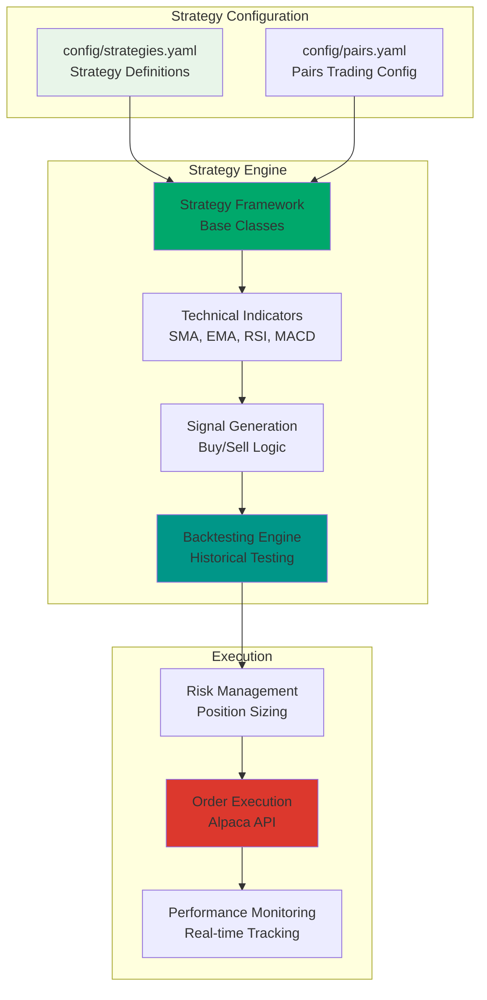
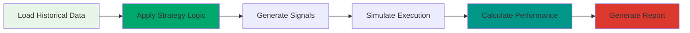
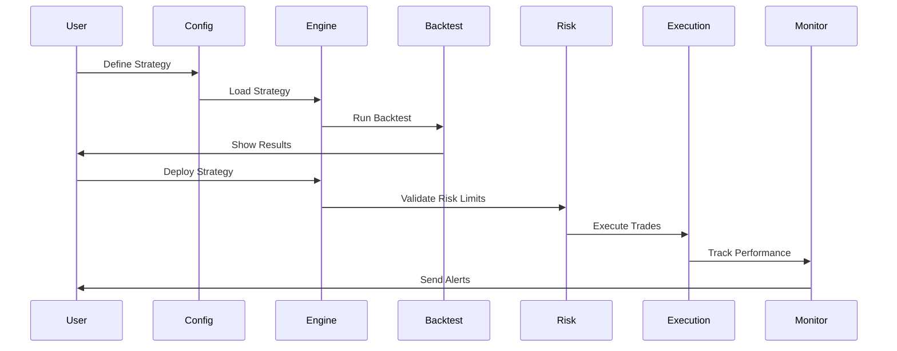

# Strategy Management

> **📋 Implementation Status**: 🚧 Planned for v1.1.0  
> **Current Status**: Strategy configuration files exist, core engine implementation pending

This guide covers strategy creation, configuration, and management for the trading system.

## Overview

The Strategy Engine will provide a comprehensive framework for creating, testing, and deploying algorithmic trading strategies. Strategies are defined using configuration files and can be backtested, optimized, and deployed to live trading.

## Strategy Architecture



## Planned Strategy Features (v1.1.0)

### 1. Strategy Creation and Configuration

Strategies are defined in `config/strategies.yaml` with the following capabilities:

- **Multiple Strategy Types**: Momentum, mean reversion, pairs trading, and custom strategies
- **Parameter Configuration**: Flexible parameter system for strategy customization
- **Risk Limits**: Per-strategy risk management settings
- **Scheduling**: Configurable execution frequency and market hours restrictions
- **Enable/Disable**: Toggle strategies on/off without removing configuration

### 2. Strategy Types

#### Momentum Strategy
Trades based on price momentum and trend following:

```yaml
- name: "momentum_strategy"
  enabled: true
  description: "Simple momentum-based trading strategy"
  parameters:
    lookback_period: 20        # Days to calculate momentum
    momentum_threshold: 0.02   # 2% price change threshold
    max_position_size: 0.1    # 10% of portfolio per position
    stop_loss: 0.05           # 5% stop loss
    take_profit: 0.10          # 10% take profit
  risk_limits:
    max_drawdown: 0.05         # 5% maximum drawdown
    max_daily_loss: 0.02       # 2% daily loss limit
    max_positions: 10          # Maximum concurrent positions
    max_sector_exposure: 0.3   # 30% max exposure per sector
  schedule:
    run_frequency: "hourly"    # Check signals hourly
    market_hours_only: true    # Only trade during market hours
```

**How It Works:**
1. Calculates price momentum over the lookback period
2. Generates buy signal when momentum exceeds threshold
3. Places stop loss and take profit orders
4. Monitors position and exits based on targets or stop loss

#### Mean Reversion Strategy
Trades based on oversold/overbought conditions:

```yaml
- name: "mean_reversion_strategy"
  enabled: false
  description: "Mean reversion strategy for oversold/overbought conditions"
  parameters:
    lookback_period: 14        # RSI calculation period
    rsi_oversold: 30          # RSI level for oversold (buy signal)
    rsi_overbought: 70        # RSI level for overbought (sell signal)
    position_size: 0.05       # 5% of portfolio per position
  risk_limits:
    max_drawdown: 0.03        # 3% maximum drawdown
    max_daily_loss: 0.015     # 1.5% daily loss limit
    max_positions: 5          # Maximum concurrent positions
  schedule:
    run_frequency: "hourly"
    market_hours_only: true
```

**How It Works:**
1. Calculates RSI (Relative Strength Index) for each symbol
2. Generates buy signal when RSI < oversold threshold
3. Generates sell signal when RSI > overbought threshold
4. Manages positions based on RSI levels

#### Pairs Trading Strategy
Statistical arbitrage using correlated stock pairs:

```yaml
- name: "pairs_trading_strategy"
  enabled: true
  description: "Statistical arbitrage using correlated stock pairs"
  parameters:
    lookback_period: 252       # 1 year of daily data
    entry_threshold: 2.0       # Z-score threshold for entry
    exit_threshold: 0.5        # Z-score threshold for exit
    stop_loss_threshold: 3.0   # Z-score stop loss
    position_size: 0.05        # 5% of portfolio per pair
    rebalance_frequency: "daily"
  risk_limits:
    max_drawdown: 0.08         # 8% maximum drawdown
    max_daily_loss: 0.03       # 3% daily loss limit
    max_positions: 8           # Maximum concurrent pairs
    max_sector_exposure: 0.4   # 40% max exposure per sector
  schedule:
    run_frequency: "hourly"
    market_hours_only: true
```

**How It Works:**
1. Identifies correlated stock pairs (e.g., AAPL-MSFT, GOOGL-META)
2. Calculates spread Z-score between pairs
3. Enters long/short positions when spread deviates significantly
4. Exits when spread returns to mean
5. Uses stop loss based on Z-score threshold

**Pairs Configuration:**
Pairs are defined in `config/pairs.yaml`:

```yaml
pairs:
  - name: "AAPL_MSFT"
    symbol1: "AAPL"
    symbol2: "MSFT"
    sector: "Technology"
    correlation: 0.85
    cointegration_pvalue: 0.001
    half_life: 12.5  # days
    description: "Apple vs Microsoft - Large cap tech leaders"
    enabled: true
    parameters:
      entry_threshold: 2.0
      exit_threshold: 0.5
      stop_loss: 3.0
      position_size: 0.05
```

### 3. Backtesting Framework

Comprehensive backtesting capabilities for strategy validation:

**Features:**
- Historical data replay with realistic execution
- Performance metrics calculation (Sharpe ratio, Sortino ratio, max drawdown)
- Risk-adjusted returns analysis
- Trade-by-trade analysis and reporting
- Walk-forward optimization
- Monte Carlo simulation

**Backtesting Workflow:**


**Example Backtest Configuration:**
```python
backtest_config = {
    "strategy": "momentum_strategy",
    "symbols": ["AAPL", "MSFT", "GOOGL"],
    "start_date": "2023-01-01",
    "end_date": "2024-01-01",
    "initial_capital": 100000,
    "commission": 0.001,  # 0.1% per trade
    "slippage": 0.0005    # 0.05% slippage
}
```

### 4. Live Strategy Deployment

Deploy validated strategies to live trading:

**Deployment Process:**
1. **Validation**: Strategy must pass backtesting with acceptable metrics
2. **Paper Trading**: Test in paper trading environment first
3. **Gradual Rollout**: Start with small position sizes
4. **Monitoring**: Real-time performance tracking and alerts
5. **Risk Controls**: Automatic position limits and circuit breakers

**Deployment Configuration:**
```yaml
deployment:
  strategy: "momentum_strategy"
  mode: "paper"  # paper or live
  initial_capital: 10000
  max_position_size: 0.1
  risk_limits:
    max_drawdown: 0.05
    max_daily_loss: 0.02
  monitoring:
    alert_on_drawdown: true
    alert_threshold: 0.03
    email_notifications: true
```

### 5. Performance Tracking

Real-time and historical performance monitoring:

**Metrics Tracked:**
- Total return and annualized return
- Sharpe ratio and Sortino ratio
- Maximum drawdown and recovery time
- Win rate and profit factor
- Average trade duration
- Position-level performance

**Performance Dashboard:**
- Real-time P&L tracking
- Strategy comparison charts
- Risk metrics visualization
- Trade history and analysis
- Performance attribution

### 6. Strategy Optimization

Optimize strategy parameters for better performance:

**Optimization Methods:**
- Grid search for parameter combinations
- Genetic algorithms for complex optimization
- Walk-forward analysis for robustness
- Out-of-sample validation
- Monte Carlo simulation for parameter stability

**Optimization Example:**
```python
optimization_config = {
    "strategy": "momentum_strategy",
    "parameters": {
        "lookback_period": [10, 20, 30, 40, 50],
        "momentum_threshold": [0.01, 0.02, 0.03, 0.04, 0.05]
    },
    "objective": "sharpe_ratio",  # Maximize Sharpe ratio
    "constraints": {
        "min_trades": 50,
        "max_drawdown": 0.10
    }
}
```

## Current Configuration

Strategy configurations are currently defined in `config/strategies.yaml`. The system supports:

- **Multiple Strategies**: Define multiple strategies in a single configuration file
- **Global Settings**: System-wide configuration for all strategies
- **Risk Limits**: Per-strategy and global risk management settings
- **Scheduling**: Configurable execution frequency

### Configuration Structure

```yaml
# config/strategies.yaml
strategies:
  - name: "momentum_strategy"
    enabled: true
    description: "Simple momentum-based trading strategy"
    parameters:
      lookback_period: 20
      momentum_threshold: 0.02
      max_position_size: 0.1
      stop_loss: 0.05
      take_profit: 0.10
    risk_limits:
      max_drawdown: 0.05
      max_daily_loss: 0.02
      max_positions: 10
      max_sector_exposure: 0.3
    schedule:
      run_frequency: "hourly"
      market_hours_only: true

# Global Strategy Settings
global_settings:
  paper_trading: true
  max_total_exposure: 0.8
  rebalance_frequency: "daily"
  log_level: "INFO"
```

### Configuration Parameters

#### Strategy Parameters
- `lookback_period`: Number of days for indicator calculation
- `momentum_threshold`: Minimum price change percentage for signal
- `max_position_size`: Maximum position size as fraction of portfolio
- `stop_loss`: Stop loss percentage
- `take_profit`: Take profit percentage

#### Risk Limits
- `max_drawdown`: Maximum allowed drawdown (fraction)
- `max_daily_loss`: Maximum daily loss (fraction)
- `max_positions`: Maximum number of concurrent positions
- `max_sector_exposure`: Maximum exposure to a single sector (fraction)

#### Schedule Settings
- `run_frequency`: How often to check for signals ("hourly", "daily", etc.)
- `market_hours_only`: Only execute during market hours (true/false)

## Strategy Workflow



## Implementation Roadmap

### v1.1.0 (In Progress) 🚧
- ✅ Strategy configuration system
- 🚧 Basic strategy framework
- 🚧 Simple moving average strategies
- 🚧 Backtesting engine
- 🚧 Performance metrics calculation

### v1.2.0 (Planned) 📋
- Advanced strategies (mean reversion, momentum, pairs trading)
- Machine learning integration
- Multi-asset strategies
- Real-time signal generation
- Advanced optimization tools

### v1.3.0 (Future) 🔮
- Custom strategy scripting language
- Strategy marketplace
- Social trading features
- Advanced risk analytics
- Portfolio optimization

## Usage Examples

### Creating a New Strategy

1. **Define Strategy in Configuration:**
   ```yaml
   strategies:
     - name: "my_custom_strategy"
       enabled: true
       parameters:
         lookback_period: 30
         threshold: 0.03
   ```

2. **Backtest the Strategy:**
   ```python
   from src.services.strategy_engine.backtest import BacktestEngine
   
   engine = BacktestEngine()
   results = engine.run_backtest(
       strategy="my_custom_strategy",
       symbols=["AAPL", "MSFT"],
       start_date="2023-01-01",
       end_date="2024-01-01"
   )
   ```

3. **Deploy to Paper Trading:**
   ```python
   from src.services.strategy_engine.deployment import StrategyDeployment
   
   deployment = StrategyDeployment()
   deployment.deploy(
       strategy="my_custom_strategy",
       mode="paper",
       initial_capital=10000
   )
   ```

### Monitoring Strategy Performance

```python
from src.services.strategy_engine.monitoring import StrategyMonitor

monitor = StrategyMonitor()
performance = monitor.get_performance("momentum_strategy")

print(f"Total Return: {performance['total_return']:.2%}")
print(f"Sharpe Ratio: {performance['sharpe_ratio']:.2f}")
print(f"Max Drawdown: {performance['max_drawdown']:.2%}")
```

## Best Practices

1. **Start with Paper Trading**: Always test strategies in paper trading before live deployment
2. **Backtest Thoroughly**: Use multiple time periods and market conditions
3. **Set Risk Limits**: Always define appropriate risk limits for each strategy
4. **Monitor Performance**: Regularly review strategy performance and adjust parameters
5. **Diversify Strategies**: Use multiple uncorrelated strategies to reduce risk
6. **Document Strategies**: Keep detailed notes on strategy logic and parameters

## Troubleshooting

### Strategy Not Executing
- Check that strategy is `enabled: true` in configuration
- Verify market hours if `market_hours_only: true`
- Check Prefect flows are running for scheduled strategies

### Poor Backtest Performance
- Review strategy parameters and adjust thresholds
- Check data quality and completeness
- Consider different time periods or market conditions
- Validate signal generation logic

### Risk Limits Triggering
- Review risk limit settings in configuration
- Check portfolio exposure and position sizes
- Adjust limits if too restrictive for strategy type

## Related Documentation

- [Strategy Engine API](../api/strategy-engine.md) - API reference for strategy engine
- [Risk Management](risk-management.md) - Risk management features
- [Configuration Guide](../../Readme.md#configuration) - System configuration
- [Backtesting Guide](../development/testing.md) - Testing and validation

---

**Last Updated**: December 2025  
**Status**: 🚧 Planned for v1.1.0
