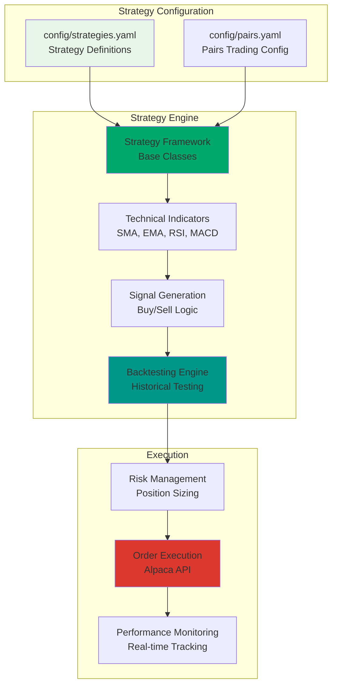
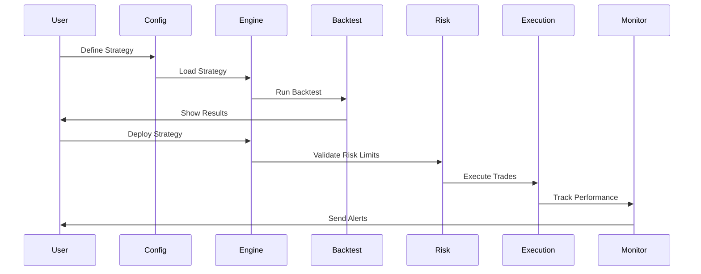

# Strategy Management

> **✅ Implementation Status**: Live in v1.1.0 — Pairs Trading active (paper trading)
> **Active Pair**: QRVO/SWKS — Semiconductor sector, rank score 0.8845

This guide covers the pairs trading strategy: discovery, backtesting, activation, and live monitoring.

## Overview

The Strategy Engine will provide a comprehensive framework for creating, testing, and deploying algorithmic trading strategies. Strategies are defined using configuration files and can be backtested, optimized, and deployed to live trading.

## Strategy Architecture


```mermaid
graph TB
    subgraph "Strategy Configuration"
        Config[config/strategies.yaml<br/>Strategy Definitions]
        Pairs[config/pairs.yaml<br/>Pairs Trading Config]
    end
    
    subgraph "Strategy Engine"
        Framework[Strategy Framework<br/>Base Classes]
        Indicators[Technical Indicators<br/>SMA, EMA, RSI, MACD]
        Signals[Signal Generation<br/>Buy/Sell Logic]
        Backtest[Backtesting Engine<br/>Historical Testing]
    end
    
    subgraph "Execution"
        RiskCheck[Risk Management<br/>Position Sizing]
        OrderExec[Order Execution<br/>Alpaca API]
        Monitor[Performance Monitoring<br/>Real-time Tracking]
    end
    
    Config --> Framework
    Pairs --> Framework
    Framework --> Indicators
    Indicators --> Signals
    Signals --> Backtest
    Backtest --> RiskCheck
    RiskCheck --> OrderExec
    OrderExec --> Monitor
    
    style Config fill:#e8f5e9
    style Framework fill:#00A86B
    style Backtest fill:#009688
    style OrderExec fill:#dc382d
```

## Planned Strategy Features (v1.1.0)

### 1. Strategy Creation and Configuration

Strategies are defined in `config/strategies.yaml` with the following capabilities:

- **Multiple Strategy Types**: Momentum, mean reversion, pairs trading, and custom strategies
- **Parameter Configuration**: Flexible parameter system for strategy customization
- **Risk Limits**: Per-strategy risk management settings
- **Scheduling**: Configurable execution frequency and market hours restrictions
- **Enable/Disable**: Toggle strategies on/off without removing configuration

### 2. Strategy Types

#### Momentum Strategy
Trades based on price momentum and trend following:

```yaml
- name: "momentum_strategy"
  enabled: true
  description: "Simple momentum-based trading strategy"
  parameters:
    lookback_period: 20        # Days to calculate momentum
    momentum_threshold: 0.02   # 2% price change threshold
    max_position_size: 0.1    # 10% of portfolio per position
    stop_loss: 0.05           # 5% stop loss
    take_profit: 0.10          # 10% take profit
  risk_limits:
    max_drawdown: 0.05         # 5% maximum drawdown
    max_daily_loss: 0.02       # 2% daily loss limit
    max_positions: 10          # Maximum concurrent positions
    max_sector_exposure: 0.3   # 30% max exposure per sector
  schedule:
    run_frequency: "hourly"    # Check signals hourly
    market_hours_only: true    # Only trade during market hours
```

**How It Works:**
1. Calculates price momentum over the lookback period
2. Generates buy signal when momentum exceeds threshold
3. Places stop loss and take profit orders
4. Monitors position and exits based on targets or stop loss

#### Mean Reversion Strategy
Trades based on oversold/overbought conditions:

```yaml
- name: "mean_reversion_strategy"
  enabled: false
  description: "Mean reversion strategy for oversold/overbought conditions"
  parameters:
    lookback_period: 14        # RSI calculation period
    rsi_oversold: 30          # RSI level for oversold (buy signal)
    rsi_overbought: 70        # RSI level for overbought (sell signal)
    position_size: 0.05       # 5% of portfolio per position
  risk_limits:
    max_drawdown: 0.03        # 3% maximum drawdown
    max_daily_loss: 0.015     # 1.5% daily loss limit
    max_positions: 5          # Maximum concurrent positions
  schedule:
    run_frequency: "hourly"
    market_hours_only: true
```

**How It Works:**
1. Calculates RSI (Relative Strength Index) for each symbol
2. Generates buy signal when RSI < oversold threshold
3. Generates sell signal when RSI > overbought threshold
4. Manages positions based on RSI levels

#### Pairs Trading Strategy ✅ Live (v1.1.0)

Statistical arbitrage using cointegrated stock pairs. Pairs are discovered automatically from DB data via `scripts/discover_pairs.py` and stored in `strategy_engine.pair_registry`.

**Active pair**: QRVO/SWKS (Semiconductors)

| Parameter | Value |
|---|---|
| Hedge ratio (β) | 0.9231 |
| Half-life | 18.4 hours |
| Correlation | 0.8697 |
| Cointegration p-value | 0.0024 |
| Z-score window | 40 bars |
| Entry threshold | ±2.0 σ |
| Exit threshold | ±0.5 σ |
| Stop loss | ±3.0 σ |
| Rank score | 0.8845 |

**How It Works:**
1. Every hour (market hours), the Prefect flow fetches the last 500 hourly bars from Alpaca
2. Computes `spread = log(P1) − β × log(P2)` and rolling z-score
3. **LONG_SPREAD** (z < −2.0): buy QRVO, short SWKS — spread expected to rise back to mean
4. **SHORT_SPREAD** (z > +2.0): short QRVO, buy SWKS
5. **EXIT** (|z| < 0.5): close both legs, take profit
6. **STOP_LOSS** (|z| > 3.0) or **EXPIRE** (hold > 3× half-life): force close

**Position sizing**: Half-Kelly criterion (bootstrap: 2% fixed for first 20 trades)

---

#### Discovering New Pairs

```bash
python scripts/discover_pairs.py
```

Runs Engle-Granger cointegration on all active symbols grouped by sector. Output: ranked table of candidate pairs. Top pairs are automatically upserted into `pair_registry` with `is_active=False`. Activate from the Backtest Review UI.

---

### 3. Backtesting Framework ✅ Live (v1.1.0)

Access via **Streamlit → Backtest Review** page (`streamlit_ui/pages/Backtest_Review.py`).

**Features:**
- Pair selector with rank score labels — activate/deactivate directly from UI
- Run backtest in-process against historical `market_data` DB
- Fills simulated at next-bar open to avoid look-ahead bias
- Pass/fail gate: Sharpe > 0.5, win rate > 45%, max drawdown < 15%
- Equity curve, trade log, run history comparison across parameter sets
- **Stock Analysis** tabs: Risk Flags (7 checks), Fundamentals, Normalised Price Chart, Rolling Correlation

**Backtest gate thresholds:**

| Metric | Gate |
|---|---|
| Sharpe ratio | > 0.5 |
| Win rate | > 45% |
| Max drawdown | < 15% |

**QRVO/SWKS backtest result** (180 days to 2026-03-27):
- Sharpe: 0.516 ✅ | Win rate: 61.5% ✅ | Max drawdown: 8.2% ✅ | Trades: 26

**Example Backtest Configuration:**
```python
backtest_config = {
    "strategy": "momentum_strategy",
    "symbols": ["AAPL", "MSFT", "GOOGL"],
    "start_date": "2023-01-01",
    "end_date": "2024-01-01",
    "initial_capital": 100000,
    "commission": 0.001,  # 0.1% per trade
    "slippage": 0.0005    # 0.05% slippage
}
```

### 4. Live Strategy Deployment

Deploy validated strategies to live trading:

**Deployment Process:**
1. **Validation**: Strategy must pass backtesting with acceptable metrics
2. **Paper Trading**: Test in paper trading environment first
3. **Gradual Rollout**: Start with small position sizes
4. **Monitoring**: Real-time performance tracking and alerts
5. **Risk Controls**: Automatic position limits and circuit breakers

**Deployment Configuration:**
```yaml
deployment:
  strategy: "momentum_strategy"
  mode: "paper"  # paper or live
  initial_capital: 10000
  max_position_size: 0.1
  risk_limits:
    max_drawdown: 0.05
    max_daily_loss: 0.02
  monitoring:
    alert_on_drawdown: true
    alert_threshold: 0.03
    email_notifications: true
```

### 5. Performance Tracking

Real-time and historical performance monitoring:

**Metrics Tracked:**
- Total return and annualized return
- Sharpe ratio and Sortino ratio
- Maximum drawdown and recovery time
- Win rate and profit factor
- Average trade duration
- Position-level performance

**Performance Dashboard:**
- Real-time P&L tracking
- Strategy comparison charts
- Risk metrics visualization
- Trade history and analysis
- Performance attribution

### 6. Strategy Optimization

Optimize strategy parameters for better performance:

**Optimization Methods:**
- Grid search for parameter combinations
- Genetic algorithms for complex optimization
- Walk-forward analysis for robustness
- Out-of-sample validation
- Monte Carlo simulation for parameter stability

**Optimization Example:**
```python
optimization_config = {
    "strategy": "momentum_strategy",
    "parameters": {
        "lookback_period": [10, 20, 30, 40, 50],
        "momentum_threshold": [0.01, 0.02, 0.03, 0.04, 0.05]
    },
    "objective": "sharpe_ratio",  # Maximize Sharpe ratio
    "constraints": {
        "min_trades": 50,
        "max_drawdown": 0.10
    }
}
```

## Current Configuration

Strategy configurations are currently defined in `config/strategies.yaml`. The system supports:

- **Multiple Strategies**: Define multiple strategies in a single configuration file
- **Global Settings**: System-wide configuration for all strategies
- **Risk Limits**: Per-strategy and global risk management settings
- **Scheduling**: Configurable execution frequency

### Configuration Structure

```yaml
# config/strategies.yaml
strategies:
  - name: "momentum_strategy"
    enabled: true
    description: "Simple momentum-based trading strategy"
    parameters:
      lookback_period: 20
      momentum_threshold: 0.02
      max_position_size: 0.1
      stop_loss: 0.05
      take_profit: 0.10
    risk_limits:
      max_drawdown: 0.05
      max_daily_loss: 0.02
      max_positions: 10
      max_sector_exposure: 0.3
    schedule:
      run_frequency: "hourly"
      market_hours_only: true

# Global Strategy Settings
global_settings:
  paper_trading: true
  max_total_exposure: 0.8
  rebalance_frequency: "daily"
  log_level: "INFO"
```

### Configuration Parameters

#### Strategy Parameters
- `lookback_period`: Number of days for indicator calculation
- `momentum_threshold`: Minimum price change percentage for signal
- `max_position_size`: Maximum position size as fraction of portfolio
- `stop_loss`: Stop loss percentage
- `take_profit`: Take profit percentage

#### Risk Limits
- `max_drawdown`: Maximum allowed drawdown (fraction)
- `max_daily_loss`: Maximum daily loss (fraction)
- `max_positions`: Maximum number of concurrent positions
- `max_sector_exposure`: Maximum exposure to a single sector (fraction)

#### Schedule Settings
- `run_frequency`: How often to check for signals ("hourly", "daily", etc.)
- `market_hours_only`: Only execute during market hours (true/false)

## Strategy Workflow


```mermaid
sequenceDiagram
    participant User
    participant Config
    participant Engine
    participant Backtest
    participant Risk
    participant Execution
    participant Monitor

    User->>Config: Define Strategy
    Config->>Engine: Load Strategy
    Engine->>Backtest: Run Backtest
    Backtest->>User: Show Results
    User->>Engine: Deploy Strategy
    Engine->>Risk: Validate Risk Limits
    Risk->>Execution: Execute Trades
    Execution->>Monitor: Track Performance
    Monitor->>User: Send Alerts
```

## Implementation Roadmap

### v1.1.0 (In Progress) 🚧
- ✅ Strategy configuration system
- 🚧 Basic strategy framework
- 🚧 Simple moving average strategies
- 🚧 Backtesting engine
- 🚧 Performance metrics calculation

### v1.2.0 (Planned) 📋
- Advanced strategies (mean reversion, momentum, pairs trading)
- Machine learning integration
- Multi-asset strategies
- Real-time signal generation
- Advanced optimization tools

### v1.3.0 (Future) 🔮
- Custom strategy scripting language
- Strategy marketplace
- Social trading features
- Advanced risk analytics
- Portfolio optimization

## Usage Examples

### Creating a New Strategy

1. **Define Strategy in Configuration:**
   ```yaml
   strategies:
     - name: "my_custom_strategy"
       enabled: true
       parameters:
         lookback_period: 30
         threshold: 0.03
   ```

2. **Backtest the Strategy:**
   ```python
   from src.services.strategy_engine.backtest import BacktestEngine
   
   engine = BacktestEngine()
   results = engine.run_backtest(
       strategy="my_custom_strategy",
       symbols=["AAPL", "MSFT"],
       start_date="2023-01-01",
       end_date="2024-01-01"
   )
   ```

3. **Deploy to Paper Trading:**
   ```python
   from src.services.strategy_engine.deployment import StrategyDeployment
   
   deployment = StrategyDeployment()
   deployment.deploy(
       strategy="my_custom_strategy",
       mode="paper",
       initial_capital=10000
   )
   ```

### Monitoring Strategy Performance

```python
from src.services.strategy_engine.monitoring import StrategyMonitor

monitor = StrategyMonitor()
performance = monitor.get_performance("momentum_strategy")

print(f"Total Return: {performance['total_return']:.2%}")
print(f"Sharpe Ratio: {performance['sharpe_ratio']:.2f}")
print(f"Max Drawdown: {performance['max_drawdown']:.2%}")
```

## Best Practices

1. **Start with Paper Trading**: Always test strategies in paper trading before live deployment
2. **Backtest Thoroughly**: Use multiple time periods and market conditions
3. **Set Risk Limits**: Always define appropriate risk limits for each strategy
4. **Monitor Performance**: Regularly review strategy performance and adjust parameters
5. **Diversify Strategies**: Use multiple uncorrelated strategies to reduce risk
6. **Document Strategies**: Keep detailed notes on strategy logic and parameters

## Troubleshooting

### Strategy Not Executing
- Check that strategy is `enabled: true` in configuration
- Verify market hours if `market_hours_only: true`
- Check Prefect flows are running for scheduled strategies

### Poor Backtest Performance
- Review strategy parameters and adjust thresholds
- Check data quality and completeness
- Consider different time periods or market conditions
- Validate signal generation logic

### Risk Limits Triggering
- Review risk limit settings in configuration
- Check portfolio exposure and position sizes
- Adjust limits if too restrictive for strategy type

## Related Documentation

- [Strategy Engine API](../api/strategy-engine.md) - API reference for strategy engine
- [Risk Management](risk-management.md) - Risk management features
- [Configuration Guide](../../Readme.md#configuration) - System configuration
- [Backtesting Guide](../development/testing.md) - Testing and validation

---

**Last Updated**: 4/3/2026  
**Status**: 🚧 Planned for v1.1.0
