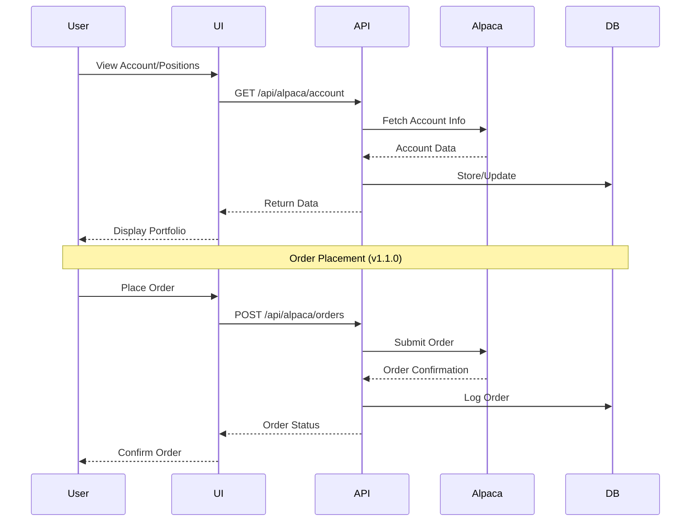

# Trading Operations

> **📋 Implementation Status**: ✅ Core functionality complete (v1.0.0)  
> **Enhanced Features**: 🚧 Planned for v1.1.0

This guide covers trading operations through the Alpaca API integration.

## Trading Flow



## Overview

The trading system integrates with Alpaca Markets for paper and live trading. The current implementation provides core trading functionality with plans for enhanced features.

## Current Features (v1.0.0)

### Account Management
- View account balance and buying power
- Monitor portfolio value
- Track cash and equity positions
- Check account status

### Position Management
- View all open positions
- Track unrealized P&L per position
- Monitor position values
- Close positions manually

### Order Management
- View open orders
- Check order status
- Cancel pending orders
- View order history

### Market Information
- Real-time market clock
- Market open/close status
- Trading hours information

## Accessing Trading Features

### Dashboard
1. Navigate to the **Trading** page from the dashboard
2. View your account information at the top
3. See your current positions in the positions table
4. Monitor open orders in the orders section

### API Endpoints

All trading operations are available through REST API:

```bash
# Get account information
GET /api/alpaca/account

# Get positions
GET /api/alpaca/positions

# Get orders
GET /api/alpaca/orders

# Close position
POST /api/alpaca/positions/{symbol}/close

# Cancel order
DELETE /api/alpaca/orders/{order_id}
```

See [Execution API Documentation](../api/execution.md) for complete API details.

## Planned Features (v1.1.0+)

### Order Placement
- Market orders
- Limit orders
- Stop orders
- Stop-limit orders
- Bracket orders
- Time-in-force options

### Advanced Features
- Automated strategy execution
- Bulk order placement
- Order templates
- Trade alerts
- Performance analytics
- Risk-adjusted position sizing

### Trading Workflows
- Pre-trade risk checks
- Automated order routing
- Post-trade reconciliation
- Trade journaling
- P&L reporting

## Safety Features

### Paper Trading
- All trades use virtual money
- Test strategies without risk
- Same API as live trading
- Safe learning environment

### Risk Controls (v1.1.0)
- Position size limits
- Maximum exposure limits
- Daily loss limits
- Automated circuit breakers

## Best Practices

1. **Start with Paper Trading**: Test thoroughly before live trading
2. **Monitor Positions**: Regularly check your open positions
3. **Use Stop Losses**: Protect against large losses
4. **Review Orders**: Double-check orders before submission
5. **Track Performance**: Monitor your trading metrics

## Troubleshooting

### Common Issues

**Connection Issues**
- Verify Alpaca API credentials
- Check internet connection
- Ensure API keys are active

**Order Failures**
- Check account buying power
- Verify market is open
- Confirm order parameters

**Position Updates**
- Positions update in real-time
- Refresh dashboard if needed
- Check order status

## Support

For trading issues:
- Check [Troubleshooting Guide](../troubleshooting.md)
- Review [Execution API Documentation](../api/execution.md)
- Contact support

*Enhanced trading features will be available in v1.1.0*